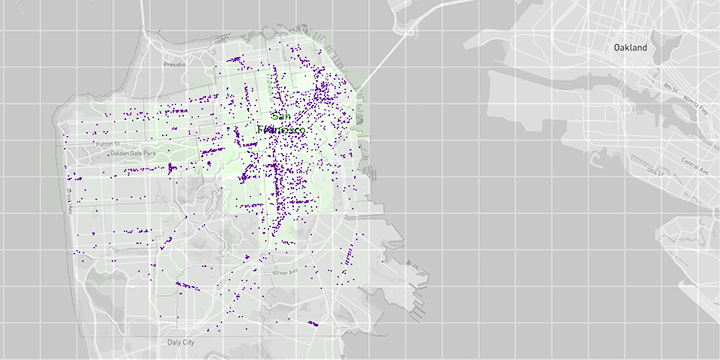

# deck.gl

A WebGL overlay suite for React providing a set of highly performant
data visualization overlays.



Design goals:
- Provide overlays that plug directly into react-map-gl's overlay model,
  enabling overlays to work on maps.
- Provide highly performant data visualization overlays in 2 and 3 dimensions.
- Provide tested, highly performant layers for basic data visualization
  use cases, scatterplots, choropleths etc.
- Allows easy creation of custom WebGL layers by subclassing `Layer`.
- Support efficient WebGL rendering in "data flow architecture" applications
  (i.e. React).
- Special focus on buffer management, allowing both automatic buffer updates
  but also full application control of buffer allocation and management


Features:
- Web Mercator projections are handled in shader on GPU. No projections are
  done in JavaScript (unless needed for a uniform calculation or reverse
  projection of e.g. picked coordinate etc). Specify your lat,lon once and
  never touch it again.
- Can accept data stored in any ES6 container
  (supporting \[Symbol.iterator\] iteration).
- Automatic and manual WebGL buffer management to support.

## Installation

```
npm install --save deck.gl
```

## Usage

```
import {
  WebGLOverlay,
  /* import layers here */
} from 'deck.gl';

const mapState = {
  latitude: 37.55,
  longitude: -122.2,
  zoom: 9,
  ...
}

<WebGLOverlay
  width={1920}
  height={1080}
  mapState={mapState},  // optional
  layers={[/* put layer instances here */]}
/>
```
---

### WebGLOverlay:

* **webgl-overlay**
A react component that takes in viewport parameters, layer instances and
generates an overlay consists of single/multiple layers sharing the same
rendering context. Internally, the webgl-overlay initializes a WebGL context
attached to a canvas element, sets up the animation loop and calls provided
callbacks on initial load and for each rendering frames. The webgl-overlay
also handles events propagation across layers, and prevents unnecessary
calculation taking advantage of the react lifecycle functions.

  **Parameters**
  * `width` (number, required) width of the canvas
  * `height` (number, required) height of the canvas
  * `longitude` (number, required) longitude of the map center
  * `latitude` (number, required) latitude of the map center
  * `zoom` (number, required) zoom level of the map

  **Callbacks**
  * `onAfterRender` [function, optional] callback after rendering is finished
  for the current frame

### Supported Layers:

* #### Choropleth Layer
The Choropleth Layer takes in [GeoJson](http://geojson.org/) formatted data and
renders it as interactive choropleths.

  **Common Parameters**

  * `id` (string, required): layer ID
  * `width` (number, required) width of the layer
  * `height` (number, required) height of the layer
  * `longitude` (number, required) longitude of the map center
  * `latitude` (number, required) latitude of the map center
  * `zoom` (number, required) zoom level of the map
  * `opacity` (number, required) opacity of the layer
  * `isPickable` [bool, optional, default=false] whether layer responses to
  mouse events

  **Layer-specific Parameters**

  * `data` (object, required) input data in GeoJson format
  * `drawContour` [bool, optional, default=false] draw choropleth contour if
  true, else fill choropleth area

  **Callbacks**

  * `onChoroplethHovered` [function, optional] bubbles choropleth properties
  when mouse hovering
  * `onChoroplethClicked` [function, optional] bubbles choropleth properties
  when mouse clicking

* #### Hexagon Layer
  The Hexagon Layer takes in a list of hexagon objects and renders them as
  interactive hexagons.

    **Common Parameters**

    * `id` (string, required): layer ID
    * `width` (number, required) width of the layer
    * `height` (number, required) height of the layer
    * `opacity` (number, required) opacity of the layer
    * `isPickable` [bool, optional, default=false] whether layer responses to
    mouse events

    **Layer-specific Parameters**

    * `data` (array, required) array of hexagon objects: [{ centroid, vertices,
    color }, ...]
    * `dotRadius` [number, optional, default=10] radius of each hexagon
    * `elevation` [number, optional, default=0.02] height scale of hexagons
    * `lightingEnabled` [bool, optional, default=false] whether lighting is
    enabled

    **Callbacks**

    * `onHexagonHovered` [function, optional] bubbles selection index when mouse
    hovering
    * `onHexagonClicked` [function, optional] bubbles selection index when mouse
    clicking

* #### Scatterplot Layer
  The Scatterplot Layer takes in and renders an array of latitude and longitude
  coordinated points.

    **Common Parameters**

    * `id` (string, required): layer ID
    * `width` (number, required) width of the layer
    * `height` (number, required) height of the layer
    * `opacity` (number, required) opacity of the layer
    * `isPickable` [bool, optional, default=false] whether layer responses to
    mouse events

    **Layer-specific Parameters**

    * `data` (array, required) array of objects: [{ position, color }, ...]
    * `radius` [number, optional, default=10] radius of each marker

* #### Arc Layer
  The Arc Layer takes in paired latitude and longitude coordinated points and
  render them as arcs that links the starting and ending points.

    **Common Parameters**

    * `id` (string, required): layer ID
    * `width` (number, required) width of the layer
    * `height` (number, required) height of the layer
    * `opacity` (number, required) opacity of the layer
    * `isPickable` [bool, optional, default=false] whether layer responses to
    mouse events

    **Layer-specific Parameters**

    * `data` (array, required) array of objects: [{ position: {x0, y0, x1, y1},
    color }, ...]

* #### Grid Layer
  The Grid Layer takes in an array of latitude and longitude coordinated points,
  aggregates them into histogram bins and renders as a grid.

    **Common Parameters**

    * `id` (string, required): layer ID
    * `width` (number, required) width of the layer
    * `height` (number, required) height of the layer
    * `opacity` (number, required) opacity of the layer
    * `isPickable` [bool, optional, default=false] whether layer responses to
    mouse events

    **Layer-specific Parameters**

    * `data` (array, required) array of objects: [{ position, color }, ...]
    * `unitWidth` [number, optional, default=100] unit width of the bins
    * `unitHeight` [number, optional, default=100] unit height of the bins


## Notes on data property

The `data` property will accept any containers that can be iterated over using
ES6 for-of iteration, this includes e.g. native Arrays, ES6 Sets and Maps,
all Immutable.js containers etc. The notable exception are native JavaScript
object maps. It is recommended to use ES6 Maps instead.

It is recommended, but not required, to use immutable data (containers AND
objects) as it ensures that changes to `data` property trigger a rerender.
(See the notes on `rerenderCount` and `updateCount` properties.)


## Notes on picking

**Note**: Because DeckGL layers are designed to take any type of iterable
collection as data (which may not support "random access" array style
references of its elements), the picking calculates and index but the
actual object.

FEATURE IDEA: The base layer could take an optional getObject(index) accessor
and call it if supplied.


## Notes on WebGL buffer management

deck.gl Layers were designed with data flow architectures like React in mind.
The challenge is of course that in the react model, every change to application
state causes a full rerender. The rendering callbacks are then supposed to
detect what changes were made a limit rerendering as appropriate. When you
have a couple of 100K element WebGL buffers to update, this can become quite
expensive unless change detection is well managed.


### Data Management using automatic Buffer updates

The layer will expect each object to provide a number of "attributes" that it
can use to set the GL buffers. By default, the layer will look for these
attributes to be available as fields directly on the objects during iteration
over the supplied data set. To gain more control of attribute access and/or
to do on-the-fly calculation of attributes.


### Manual Buffer Management

For ultimate performance and control of updates, the application can do its
own management of the glbuffers. Each Layer can accept buffers directly as
props.

**Note:** The application can provide some buffers and let others be managed
by the layer. As an example management of the `instancePickingColors` buffer is
normally left to the layer.

**Note**: A layer only renders when a property change is detected. For
performance reasons, property change detection uses shallow compare,
which means that mutating an element inside a buffer or a mutable data array
does not register as a property change, and thus does not trigger a rerender.
To force trigger a render after mutating buffers, simply increment the
`renderCount` property. To force trigger a buffer update after mutating data,
increment the `updateCount` property.


## Notes on Blending Modes

To get a handle on blending modes, it helps to consider that deck.gl
renders in a separate transparent div on top of the map div,
so it is actually the browser that blends the deck.gl output into the map,
not WebGL, and the default blending in the browser typically does not give
ideal effects.

There is a CSS property `mix-blend-mode` in modern browsers
that allows control over blending:
```
.overlays canvas {
  mix-blend-mode: multiply;
}
```
`multiply` blend mode is usually the right choice, as it only darkens.
This will keep your overlay colors, but let map legends underneath
remain black and legible.

**Note:** that there is a caveat with setting `mix-blend-mode`:
it can affect other peer HTML elements, especially other map children (perhaps
controls or legends that are being rendered on top of the map).
If this is an issue, set isolation CSS prop on the map (DeckGLOverlay parent)
element.
```
     isolation: 'isolate'
```

## Example
```
npm run start
```

## Data source

https://data.sfgov.org/
