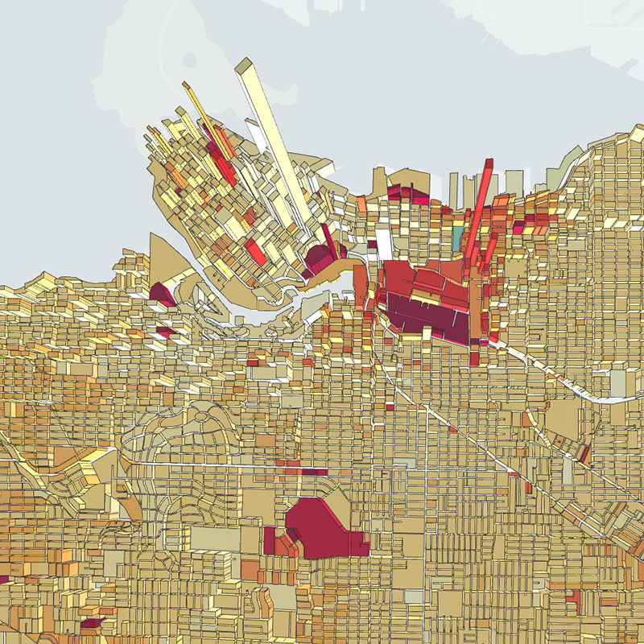
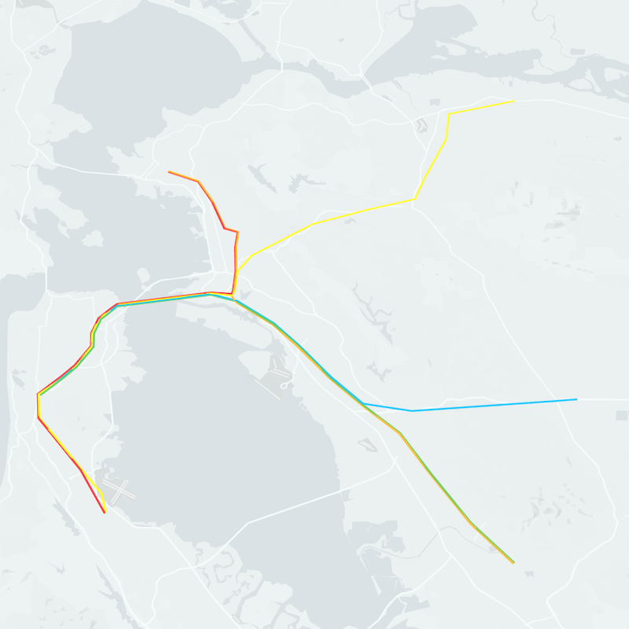
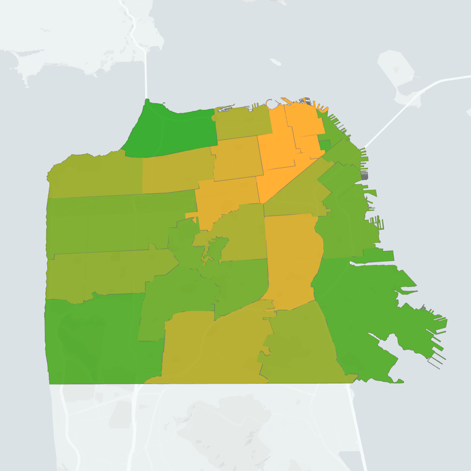
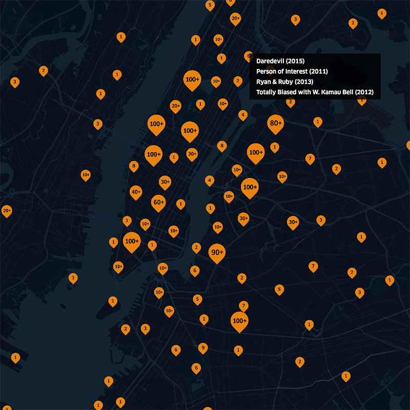
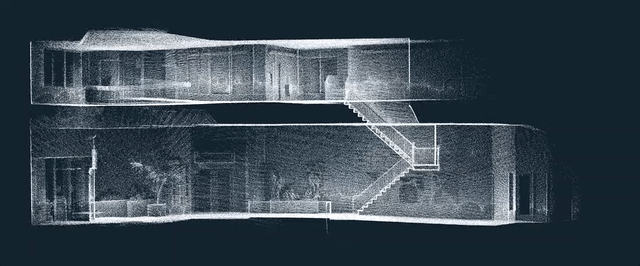
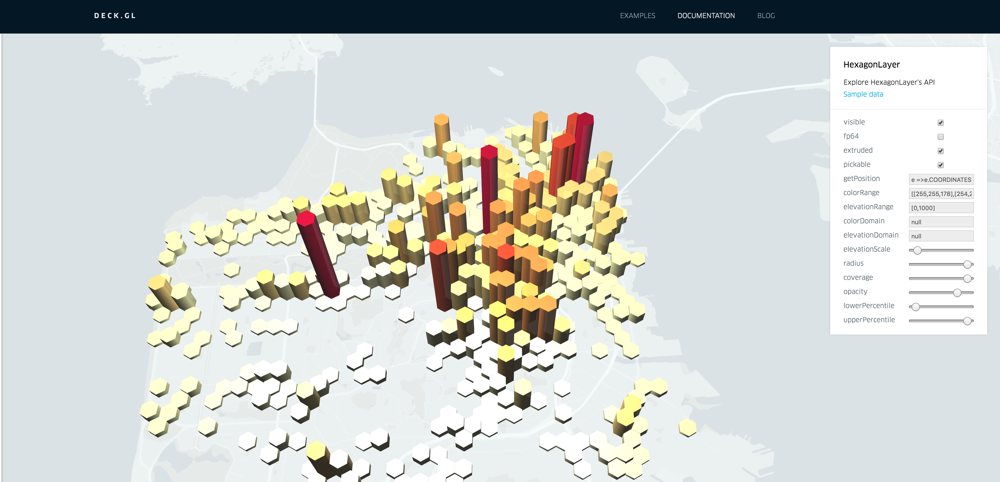

## Introducing deck.gl v4.0

We've just released a new major version of deck.gl, so this is a good time to share some information about the improvements that went into the new version, the rationale behind them, and provide some hints on what we are currently thinking about the future of deck.gl.

### What Motivated the Release?

Since the big deck.gl v3 release in November 2016, deck.gl has seen rapid adoption across a number of internal data visualization applications at Uber. We have also received many good comments, suggestions and requests, both from internal and external users. We noticed that developers are not only building apps using deck.gl's highly performant layers, but also starting to unleash their own creativity by creating various new layers. This is pushing deck.gl into areas that we have never thought it would be.

While some of these layers are highly specialized and application specific, many others are general-purpose and solves some common problems in certain applications. Those general-purpose layers saves other developers with similar needs considerable amount of time, so why reinvent the wheel?

Therefore, in this v4 release, the stars are the new layers enlisted in our deck.gl layer catalog that do magic with data. Now, the numder of core layers in deck.gl has grown to over a dozen and all of them are carefully audited, tested and documented [layers](https://uber.github.io/deck.gl/#/documentation/layer-catalog).

### Why a Major Version Bump?

As part of the release work we conducted an extensive API audit of both
the new v4 layers and the existing v3 layers and found that doing a small set
of changes to existing v3 layer APIs would allow us to make the APIs
of all layers considerably more consistent and the whole framework more
cohesive and logical.

We take backwards compatibility of deck.gl very seriously, and the decision to
make any breaking changes to our API is not taken lightly, and in spite of the
major version bump, deck.gl v4 is highly compatible with deck.gl
v3, both in terms of public APIs and the way layers work.

Also, to ensure a smooth transition, an
[update guide](https://uber.github.io/deck.gl/#/documentation/overview/upgrade-from-v3)
is provided and we expect the upgrade effort for applications to be minimal.

Note: deck.gl follows [semver](http://semver.org) versioning rules so
any change to existing functionality requires us to bump
the major version number, from 3 to 4 in this case.

## A Growing Layer Catalog

Deck.gl is a geospatial data visualization framework from the very beginning and geospatial use cases will always be the top priority. The new layers added to the [layer catalog](https://uber.github.io/deck.gl/#/documentation/layer-catalog) are widely used in geospatial data analysis within Uber and we hope they will solve the problems of deck.gl users face everyday.

### [`GeoJsonLayer`](https://uber.github.io/deck.gl/#/documentation/layer-catalog/geojson-layer)

	

The GeoJsonLayer is designed to render geometry primitives in the widely accepted GeoJson data format. The GeoJsonLayer itself is very powerful as it renders multiple types of geometry primitives, including points, lines, multilines, polygons and multipolygons all at once. Moreover, it can render polygons and multipolygons in different styles, currently supporting filled and outline styles in 2D, and filled and wireframe styles in extruded.

The flexibility of the GeoJson layer combined with deck.gl's high rendering performance makes it possible to render large amount of data on the city or even the world level, like what we are doing in the GeoJson layer example on our demo site. [links here]

### [`PathLayer`](https://uber.github.io/deck.gl/#/documentation/layer-catalog/path-layer)

	

The `PathLayer` is created to render a path consists of multiple line segments specified by a sequence of coordinates. The path drawn has customizable width with mitered or rounded line joints.

### [`PolygonLayer`](https://uber.github.io/deck.gl/#/documentation/layer-catalog/polygon-layer)

	

The `PolygonLayer` renders general flat or extruded polygons specified by a "closed" sequence of coordinates, like how polygon features are specified in the GeoJson specifications. Polygons can be rendered as filled or outline in 2D and filled or wireframe in 3D. This layer supports rendering convex, concave and polygon with holes.

### [`IconLayer`](https://uber.github.io/deck.gl/#/documentation/layer-catalog/icon-layer)

	

The `IconLayer` allows the user to render customizable markers on top of the base map. Multiple icons can be used in a single layer through a texture atlas and a configuration object in JSON. The size of the icons can be separately controlled and bounded with user specified values.

### [`PointCloudLayer`](https://uber.github.io/deck.gl/#/documentation/layer-catalog/point-cloud-layer)

	

The `PointCloudLayer` is designed to visualize 3D point cloud data, usually generated from different types of sensors that are ubiquitous nowadays. Point cloud data can contain position, normal and color values to control the style of rendered points, whic are "billboarded" towards the user.

### [`GridLayer`](https://uber.github.io/deck.gl/#/documentation/layer-catalog/grid-layer) and [`HexagonLayer`](https://uber.github.io/deck.gl/#/documentation/layer-catalog/hexagon-layer)

	

In this deck.gl release, we add these two special layers that goes beyond simply putting user data on the map. This is a very exiciting new direction of deck.gl as we not only want to provide layers that are visually compelling to our users, but also ***smart***. The `GridLayer` and `HexagonLayer` draw equal-area rectangular or hexagonal cells. At the same time they "bin" user-provided point data into cells and do aggregations on the data points that fall into those cells. The aggregated values can be mapped to the color of the cells, the height of the cells, or both, depending on the specific style settings. This effectively makes these two layers two different implementations of typical grid-based **heatmaps**. Both layer supports 2D and 3D cells.

The `GridLayer` and `HexagonLayer` are different from the `ScreenGridLayer`
provided in the previous version as both the rendered geometry and the
aggregation boundaries are in ***world coordinates*** rather than screen
coordinates.

## Layer extrusion and lighting

Some of deck.gl layers now support extrusion. Extrusion can be enabled by setting the `extruded` property to true, if available. Users can provide a `getElevation` accessor to control how much each individual element would extrude.

To make extrusion looks natural and make extruded layers look visually pleasing, deck.gl v4 includes an experimental lighting module that provides basic shading of 3D layers. It has very straightforward APIs and should be easy for users to understand by simplying looking at every increasing number of examples that comes with deck.gl. It's worth mentioning that since it's experimental, the public APIs might change in the future release of deck.gl.

## Interactive Documentation

Deck.gl's documentation has been significantly improved and reorganized in response to user feedback. In particular, every layer now has an interactive layer browser allowing users to tweak all properties of the layer and see how they affect the final rendering of layers while reading the docs. It also serves as an intuitive tool for users to select appropriate layers for their use cases.

	

## Stand-Alone Examples

deck.gl v3 came with essentially a single example that was interleaved with the complicated build scripts and extensive package dependencies of the main library. This has been called out by many entry-level users, so the deck.gl team decide to provide multiple stand-alone examples with minimal configuration files. These examples should jump start the learning process of deck.gl and intrigued users can easily copy them out and bootstrap their own apps from them. These examples are located in the [example folder](https://github.com/uber/deck.gl/tree/master/examples) in deck.gl's main repository.

## Interoperability Examples

To leverage your knowledge in data visualization with the tools you are familiar with, we also provide examples to demonstrate the interoperability between deck.gl and regular SVG-based visualizations. That is, you can use for example the modularized d3-* utilities for layout calculation, and have deck.gl take care of the rendering, so there is no heavy DOM manipulations and you get GPU-accelerated rendering of up to millions of elements for free.

## What’s Next?

Deck.gl v4 is an important milestone for us, but what's next? While we haven't finalized
any plans for a possible deck.gl v4.1 or v5 release yet, we have many ideas about
improvements and directions we would like deck.gl to evolve along. Some examples are:

### More and Better Layers

Layers are how deck.gl creates value for most users, so obviously we plan to add more layers. We will of course always keep improving support for the geospatial vusalizations but we are also
considering supporting abstract visualizations in the InfoVis area.

We also encourages all deck.gl users and developers to consider share your fancy new layers with the deck.gl community (github pull requests are welcome). If your layer helps address some common needs and/or accomplish some common tasks in any areas of data visualization, they might even end up being included in the core layers catalog of deck.gl in a future release!

### Text Rendering Support

Text is crucial in many data visualization applications and can be implemented in various ways depending on specific use cases. Using WebGL to render text labels or geometries is both performant and versatile, but can be non-trivial to implement. In deck.gl v4 we are not providing any official support for text rendering besides a basic sample layer called ["LabelLayer"](https://github.com/uber/deck.gl/tree/master/examples/sample-layers/label-layer). This is an area we are actively investigating how to improve support.

### Expanding and Improving Aggregation

The new aggregating layers in deck.gl v4 are only scratching the surface of what can be done
in terms of adding data processing intelligence to deck.gl. More advanced aggregation algorithms are being researched, and will be implemented if they are useful for our internal or external customers.

### More Data Processing (possibly on GPU) for Geospatial Data Analysis

As we march forward in the geospatial data analysis field, it's obvious that the single threaded Javascript engine in our browsers will soon be overwhelmed by computation intensive tasks. We can solve this by seeking help from backend, but not without its own limitations. The recently released WebGL 2.0 provided a way to access powerful GPUs on every desktops and laptops in a way that is not possible in the past. With features like transform feedback, we might be able to vastly accelerate many computational tasks in geospatial data analysis.

We have already started experimenting with the powerful features in the newly released WebGL 2.0 standard to do not only rendering, but also data aggregation on the GPU.

### Improved Layer Composition

In the new v4 release of deck.gl, some new layers like the `GeoJsonLayer` and `HexagonLayer` are what we called **composite** layers as they are actually built by "composing" other core deck.gl layers. The composite layers have their own props but leverage its underlying layers for part of their functionalities. This kind of composition greatly reduces the effort required for creating new layers and makes the internal structure of many layers much cleaner. In future releases, we will continue making composite layer development easier by decoupling different sets of functionalities of layers and keeping improving our guides and docs.

### More Advanced Picking (Selection) Support

Picking or selection is also one of the most common tasks of any data visualization applications and is a core functionality we provide with deck.gl. In the v4 release, a color-coded picking process that are both much more robust and performant is implemented. We plan to continue improving picking by adopting better picking boundary arbitration, supporting square or polygon area picking, etc.

### Performance

Performance is always what we are seeking as deck.gl, from the first day, is designed to be a **high performance** visualization framework. Many under-the-hood performance improvements went into the v4 release, including a 3.5~4X faster scatterplot layer, faster 64-bit maths, and ~2X performance boost in picking, etc. In the future, we are considering implementing a better WebGL state manager that faciliates the resource sharing and reuse, a better layer manager that manages and updates resources in a smarter way and a better rendering engine that only allows necessary data to hit GPUs from the very beginning.

## Final Words

Finally, just in case there is any doubt from our users, we would like to reiterate our commitment that deck.gl will remain a "geospatial visualization first" framework. All the non-geospatial use cases we are showing will not compromise our focus on improving the geospatial visualization aspects of deck.gl. To the contrary, as we mentioned earlier in this article, users can expect see even more "advanced" geospatial processing functionalities to the future releases of deck.gl.
