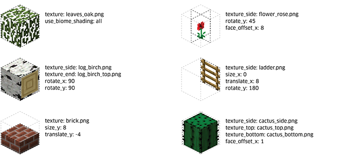
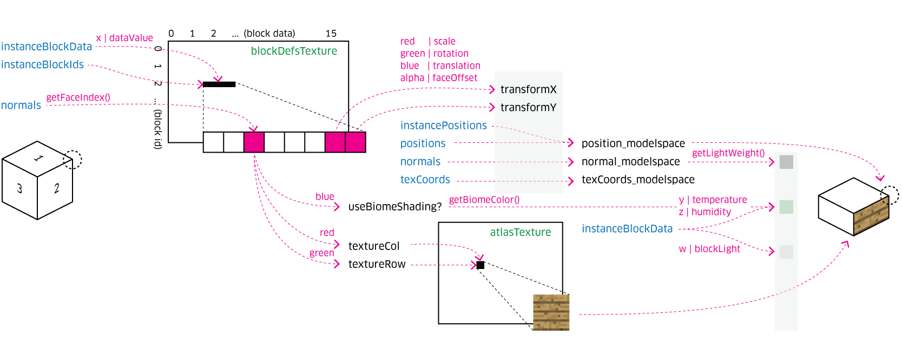
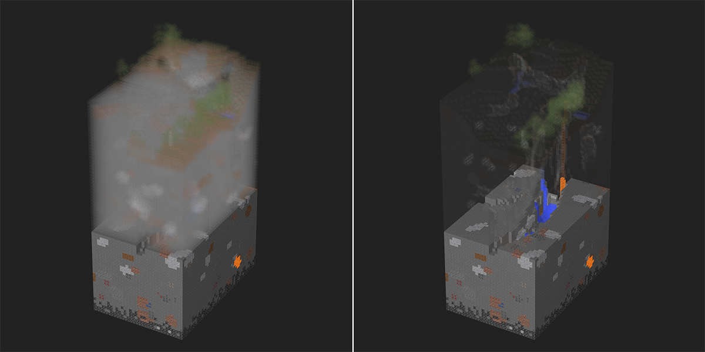

While working on [deck.gl v4](./introducing-deckgl-v4.html), I decided to have some fun and built a [Minecraft Chunk Viewer](http://pessimistress.github.io/minecraft/) in the browser. Drag in a region file from your own world and explore the world in depth! Totally not cheating.

- [Region files](http://minecraft.gamepedia.com/Chunk_format) are in your Minecraft's save folder with names like **r.12.34.mca**. Check [this page](http://minecraft.gamepedia.com/.minecraft) to see where to find them.
- Drag to rotate; drag while holding *shift* to pan
- Use the slider to slice the world
- Hover over a block to see details
- Click on the minimap to select other chunks; click while holding *shift* to select multiple chunks

  

For those who are interested, I'll dive into how this was built.

## An Overview of the App

The chunk viewer itself is a pretty straight forward React one page app. Here are some of the critical components of the [source code](https://github.com/Pessimistress/minecraft-chunk-viewer/tree/master/src):

+ `app.js` - Root. Lays out all the components and stores all the states.
+ `components/orbit-controller.js`
     The component that handles user interaction with the 3D view. It maps pointer and wheel input to changes in the deck.gl viewport. It is rendered as the parent of the `DeckGL` canvas to capture all pointer events.
+ `minecraft-layer/`
     A custom deck.gl layer that does the rendering magic.
+ `utils/mca-parser.js`
     Util functions that parse a **.mca** file. Based on the work of [minecraft-region](https://github.com/maxogden/minecraft-region).
+ `utils/orbit-viewport.js`
     An implementation of the deck.gl [Viewport](http://uber.github.io/deck.gl/#/documentation/api-reference/viewport) class, used by the `OrbitController`.

When the file is loaded and chunks are selected, the app calls `readChunks()` from the parser utils to update the data. The world is represented as an array of block objects, each containing information such as position (in-game `x` `y` `z` coordinates), block id (type of block), block data (block-specific metadata), biome and light level.

Because deck.gl does not do dynamic z-sorting (to prioritize performance), it's important to draw the solid blocks before the transparent ones to avoid depth clipping.
Luckily, in this use case the interesting view angle is always from top down. When loading the blocks, they are sorted by `y` from bottom to top, so that the lower levels are rendered first.

The data is then passed in to create an instance of the `MinecraftLayer` - the custom layer that renders Minecraft blocks.

## The Minecraft Layer

### The MinecraftLayer Class

[MinecraftLayer](https://github.com/Pessimistress/minecraft-chunk-viewer/tree/master/src/minecraft-layer/index.js) extends deck.gl's base `Layer` class. At initialization (`initializeState()`), it does the following:

- Creates a single instanced model that defines what to render. An instanced model duplicates the same geometry ("instance") many times with slight variations. Naturally in Minecraft, each instance is a cube.
- Adds attributes. The attributes are per instance and determines how each cube will look. Each attribute has an `update` function that will only be called once when `props.data` changes. The attributes carry the following information to the vertex shader:
  + `position` - the `x` `y` `z` coordinates of the block
  + `blockId` and `blockData` - [block data values](http://minecraft.gamepedia.com/Data_values)
  + `temperature` and `humidity` - used to calculate biome shading
  + `lighting` - the light level of a block, either from sky light or self illumination
- Loads textures. The layer loads three textures that are sent to the shaders as uniforms:
  + `blocks.png` - this is the encoded block metadata, will discuss below.
  + `textures.png` - this is an all-up texture atlas of all Minecraft textures.
  + `foliage.png` - this is the definition of biome colors, as explained [here](http://www.planetminecraft.com/blog/biomes-controlling-color/).

At each rendering cycle, the method `draw()` is called to render the model to the WebGL context.

### Passing Block Metadata to the GPU

An unique challenge in this project is that there are many variables playing into the appearance of a block. Each face of the cube has its own texture and biome shading behavior. To make a single cube geometry work with as many block types as possible, I introduced "transforms" that can be applied to each the block: rotation (e.g. logs), size (e.g. half slabs), translation (e.g. ladders) and face offset (e.g. flowers).

All together the texture properties and block transforms add up to 20+ float attributes per instance. Sadly WebGL1 does not handle arrays easily. To avoid creating a long list of attributes, I opt to encode all the block definitions into one image texture. There is an 8-pixels slot assigned to each (`blockId`, `blockData`) combination, and each channel (`r` `g` `b` `a`) can be used to store one property. Now the vertex shader can look up block definitions on the fly:

### The Shaders

At render time, the vertex shader looks up block definitions using id, data value and face index. The block-level transforms are applied to vertex positions and normals. Texture coordinates are passed to the fragment shader, where colors are touched up with biome shading, lighting, mouse hover highlight, etc.

The Y-slicer position is passed in as a uniform and essentially reduces the alpha of all blocks above the given level. It is an inexpensive operation but extremely useful when you need to peek into the belly of a chunk. I am quite pleased with how it works out.

Here's a big gotcha regarding the block definition lookup. When I first implemented it, the rendering result was a mess: grass blocks were consistently rendered as wood planks, dirt as cobble stones, and block orientations were all weird. I double and then triple checked my asset generation script, but everything looked correct. It seemed that the vertex shader was just reading the wrong rgb values out of the texture.

Turns out that *the rgb precision is affected by the alpha channel*. When alpha is 255, the rgb values are read exactly as what I wrote into the image. As the alpha decreases, the rgb values start to show an increasing margin of error. It makes sense in image display because when opacity is very low, the single-digit difference is rounded away by blending; but this becomes a big problem when I use them to encode texture indices. This behavior is also apparently GPU-dependent, because the same image worked on my Macbook and did not on iOS. The advice is to avoid using the alpha channel if possible, or at least keep the number in the upper range.

### Optimization

A typical chunk is over 20k blocks, that is 240k triangles to render. When multiple chunks are selected, it quickly becomes too much for the browser. A cheap improvement is to turn on face culling (`gl.enable(gl.CULL_FACE)`), which immediately reduce the number of fragments in half.

To make things even faster, we can skip the surfaces that are right against a solid block. Only those that are behind air, transparent texture (e.g. water, leaves) or irregular shaped blocks (e.g. stairs) need to be rendered.

When parsing the region file, a hashmap is built to track whether each block is opaque or not. An accessor `getIsBlockOpaque` is introduced to the Minecraft Layer to look up the transparency flag for any block coordinates. The layer then creates an attribute `instanceVisibilities` which tells the vertex shader what's next to each face of the cube. Here's a comparison between rendering without and with this optimization:

## Cool, What's Next?

This all started as a weekend project. deck.gl was great as a foundation for this kind of experiment -- it took care of most of the chores such as attribute mangement, update cycles, projection and picking. I was able to spend most of my time focusing on Minecraft-specific code.

Right now the chunk viewer only supports limited Minecraft block types, because I got lazy halfway into scraping the Wiki. My hacky tricks with cubes obviously will not work with every entity out there (no mobs, for example). But surely there are a lot more improvements I can make. Checkout the [issues list](https://github.com/Pessimistress/minecraft-chunk-viewer/issues) and make a suggestion!

Now pardon me as I go dig up that diamond ore.
