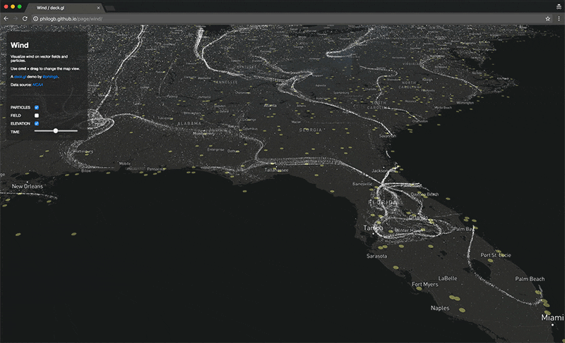

  <iframe src="https://www.youtube.com/embed/4qm_dO4nAk0" frameborder="0" allowfullscreen></iframe>

A few weeks ago I set on trying out new WebGL 2.0 features with deck.gl. WebGL 2.0 brings plenty of new goodies to be used for game development, creative coding and data visualization like instancing, floating-point textures, transform feedback, multiple render targets, and more. With this in mind, and inspired by the work of Cameron Beccario, Viegas and Wattenberg, and NASA, I created a WebGL 2.0 wind map demo using deck.gl.

This [interactive demo](http://philogb.github.io/page/wind/) enables you to change the map’s perspective by using cmd + drag; toggle between vector field and particle layers on the left panel, and use the slider to change the time of day to see wind change for a 72 hour period. 

## Some interesting insights

The screenshot below shows wind speed near Mount Washington, which has the fastest winds in the US.

Something interesting to look at as well are the wind corridors being formed in Florida at specific times.

## Under the hood

There are thousands of stations that capture wind speed, orientation and temperature with different time granularity. If you turn all layers off you’ll see yellow dots that represent each one of the stations we’re getting data from.

### The Delaunay Interpolation Layer

For this example though one of the challenges was to be able to get a uniform distribution of wind speed, direction and temperature that could be sampled at any point of the map, not simply at each station. In order to do this we created a Delaunay tessellation for the stations, and then rendered the mesh to a floating-point texture, to get GPU-interpolated values into an image. In this case we map wind direction to the red channel, wind speed to green, temperature to blue and elevation to alpha.

You can see the interpolated wind data rendered to an image below:

### The Vector Field Layer

The next step was to use instancing to create a regular vector field layer. For this we created tetrahedron instances to serve as arrows and used the texture above to set their orientation, color and size. If you use the slider on the left you’ll also see that there’s GPU interpolation. Although we sample data every hour, we interpolate between the textures so we can estimate the values at each minute. Since we already had the Delaunay model we also used that to give an approximation of the elevation in the US:

### The Particle Layer

Finally we used [transform feedback](https://open.gl/feedback), which enables us to only use the vertex shader for data processing and updating every particle’s position in real-time. We throw a random sample of particles (~1MM) that get updated by the texture data, and then render those on the screen. Every particle has a TTL (time-to-live); when the TTL expires it gets repositioned at a random location on the map. Blending reveals where the biggest concentration of particles are.

  

And that’s it! Three custom layers built with deck.gl to bring this wind map to life. Check out [the example](http://philogb.github.io/page/wind/) and feel free to provide feedback!
