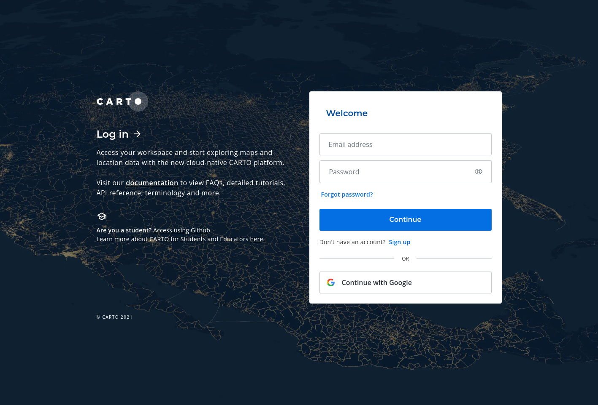

Authentication
==============

Pydeck-carto supports two types of authentication using the `carto-auth <https://github.com/cartodb/carto-auth>`_ package:

* Authentication using OAuth
* Authentication using M2M file

OAuth
^^^^^

Use your CARTO account to authenticate with Python from a notebook (in local or remote), or from a Python script. This is available for any CARTO user.

.. code-block:: python

    from carto_auth import CartoAuth

    carto_auth = CartoAuth.from_oauth()

The `carto_auth` object will be used to obtain the CartoLayer credentials.

This method supports the following parameters:

* *cache_filepath* (str, optional): File path where the token is stored. Default "home()/.carto-auth/token_oauth.json".
* *use_cache* (bool, optional): Whether the stored cached token should be used. Default True.
* *open_browser* (bool, optional): Whether the web browser should be opened to authorize a user. Default True.
* *api_base_url* (str, optional): Base URL for a CARTO account.
* *org* (str, optional): [Single Sign-On (SSO)](https://docs.carto.com/carto-user-manual/settings/users-and-groups/sso) organization in CARTO.

M2M (advanced)
^^^^^^^^^^^^^^

Use a file with M2M credentials to automatically login into a CARTO account. It can be uses for ETL processes .This is available for Enterprise CARTO users.

.. code-block:: python

    from carto_auth import CartoAuth

    carto_auth = CartoAuth.from_m2m("./carto-credentials.json")

This method supports the following parameters:

* *filepath* (str): File path of the CARTO credentials file.
* *cache_filepath* (str, optional): File path where the token is stored. Default "home()/.carto-auth/token_m2m.json".
* *use_cache* (bool, optional): Whether the stored cached token should be used. Default True.

CARTO credentials file
~~~~~~~~~~~~~~~~~~~~~~

To generate CARTO Auth tokens in carto-auth you need to create a `carto_credentials.json` file with the following content:

.. code-block:: json

    {
        "api_base_url": "https://gcp-us-east1.api.carto.com",
        "client_id": "XXXXXXXXXXXXXXXXXXXXXXXXXXXXXXXX",
        "client_secret": "XXXXXXXXXXXXXXXXXXXXXXXXXXXXXXXXXXXXXXXXXXXXXXXXXXXXXXXXXXXXXXXX"
    }

To obtain the file's content, go to the Developers section in the CARTO Dashboard. More information in https://docs.carto.com/carto-user-manual/developers/carto-for-developers/#carto-for-developers.

**API Base URL**

You can directly copy the *API Base URL*. It will be different depending on the region where your account is located.

**Built applications**

Create a new "Machine to Machine" application to generate the *Client ID* and *Client Secret*.

* Click on "+ Create new".
* Fill in the name and description. The URL is irrelevant in this case, so feel free to use something like https://example.domain.com.
* Open the "Advanced Settings" menu.
* In "Application Type" select "Machine to Machine".
* Click "Save" and check that your application is listed.

From the list, copy the new *Client ID* and *Client Secret* and add them into your credentials file.
