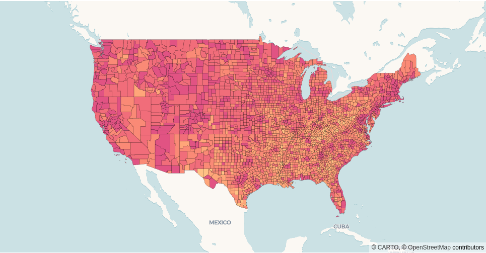

| `Pydeck <https://pydeck.gl/index.html>`_ wrapper for use with `CARTO <https://carto.com>`_ and powered by `deck.gl <https://deck.gl/#/>`_.

Get started by `installing pydeck-carto <installation.html>`_.

Index
^^^^^

.. toctree::
   :maxdepth: 1
   :titlesonly:

.. toctree::
   :maxdepth: 1
   :caption: Getting started

   installation
   authentication

.. toctree::
   :maxdepth: 2
   :caption: API Reference

   layers
   sources
   styles

.. toctree::
   :maxdepth: 2
   :caption: Development

   contributing
   changelog

.. raw:: html

   
