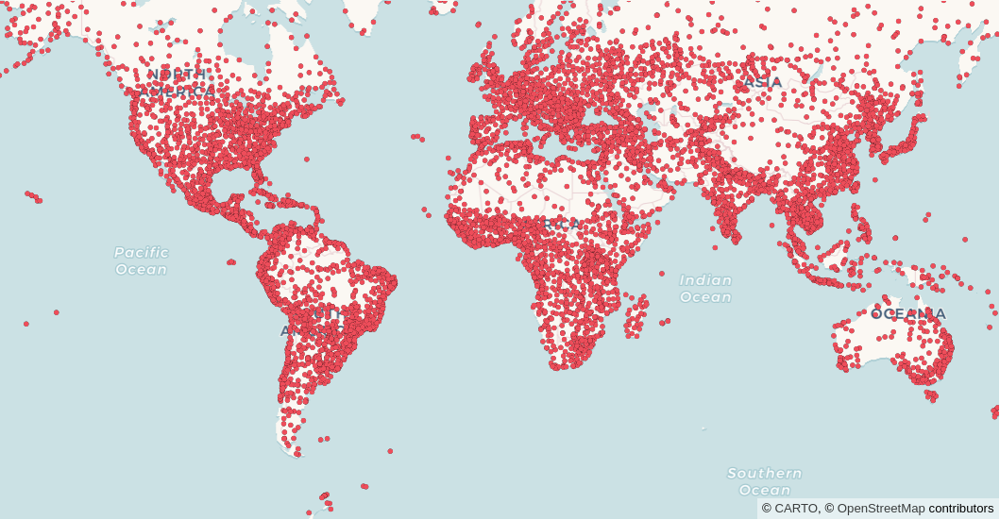

CARTO Layer
===========

CartoLayer renders cloud data from any connection (BigQuery, Snowflake, Redshift, Postgres, Databricks). It's a wrapper over the `CartoLayer in deck.gl <https://deck.gl/docs/api-reference/carto/carto-layer>`_.

Pydeck-carto is a package outside of pydeck, so calling :meth:`pydeck_carto.register_carto_layer` is required to register CartoLayer in pydeck.

Example
^^^^^^^

.. code-block:: python

    import pydeck as pdk
    from carto_auth import CartoAuth
    from pydeck_carto import register_carto_layer, get_layer_credentials, notify_error
    from pydeck_carto.layer import MapType, CartoConnection

    # Authentication with CARTO
    carto_auth = CartoAuth.from_oauth()

    # Register CartoLayer in pydeck
    register_carto_layer()

    # Render CartoLayer in pydeck
    layer = pdk.Layer(
        "CartoLayer",
        data="SELECT geom, name FROM carto-demo-data.demo_tables.airports",
        type_=MapType.QUERY,
        connection=CartoConnection.CARTO_DW,
        credentials=get_layer_credentials(carto_auth),
        get_fill_color=[238, 77, 90],
        point_radius_min_pixels=2.5,
        pickable=True,
        on_data_error=notify_error(),
    )
    view_state = pdk.ViewState(latitude=0, longitude=0, zoom=1)
    pdk.Deck(layer, map_style=pdk.map_styles.ROAD, initial_view_state=view_state)

Parameters
^^^^^^^^^^

* **data**: (``str``) Either a SQL query or a name of dataset/tileset.

* **type_**: (``pydeck.types.String``) Type of the input data. It can be either QUERY, TABLE or TILESET. :meth:`pydeck_carto.layer.MapType`.

* **connection**: (``pydeck.types.String``) Name of the connection registered in the CARTO Workspace. The connection for the CARTO Data Warehouse is already defined as a constant :meth:`pydeck_carto.layer.CartoConnection`.

* **credentials**: (``dict``) Defines the app credentials to gather the information from CARTO. It is recommended to use :meth:`pydeck_carto.get_layer_credentials` to obtain automatically the token from Oauth using the `carto-auth package <https://github.com/cartodb/carto-auth>`_.

* **geo_column**: (``pydeck.types.String``, optional) Name of the geo_column in the CARTO platform. It also support spatial indexes (h3, quadbin) :meth:`pydeck_carto.layer.GeoColumnType`.

* **on_data_error** (``pydeck.types.Function``, optional): Callback called when the request to the CARTO Maps API failed. It is recommended to use with :meth:`pydeck_carto.notify_error` to display the error in the visualization.

Reference
^^^^^^^^^

.. automodule:: pydeck_carto
    :members:

.. autoclass:: pydeck_carto.layer.MapType
.. autoclass:: pydeck_carto.layer.MapType.QUERY
.. autoclass:: pydeck_carto.layer.MapType.TABLE
.. autoclass:: pydeck_carto.layer.MapType.TILESET

.. autoclass:: pydeck_carto.layer.CartoConnection
.. autoclass:: pydeck_carto.layer.CartoConnection.CARTO_DW

.. autoclass:: pydeck_carto.layer.GeoColumnType
.. autoclass:: pydeck_carto.layer.GeoColumnType.H3
.. autoclass:: pydeck_carto.layer.GeoColumnType.QUADBIN
