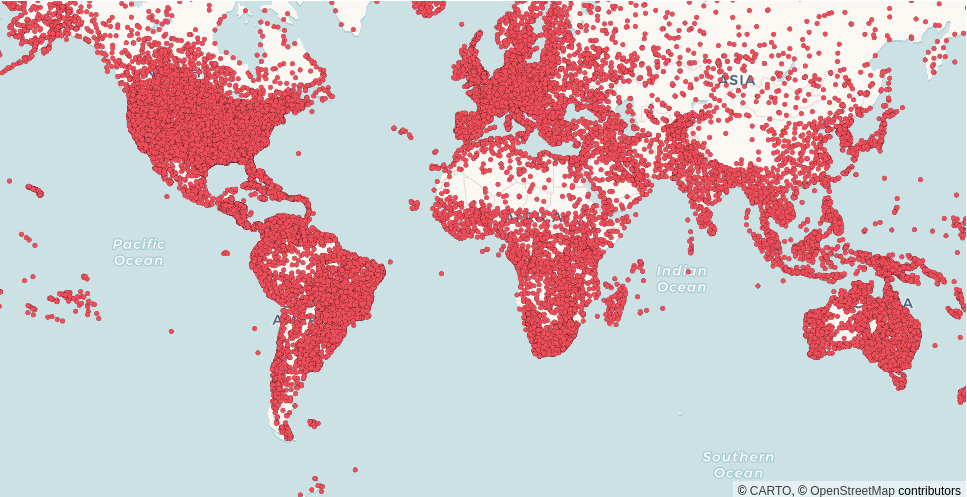
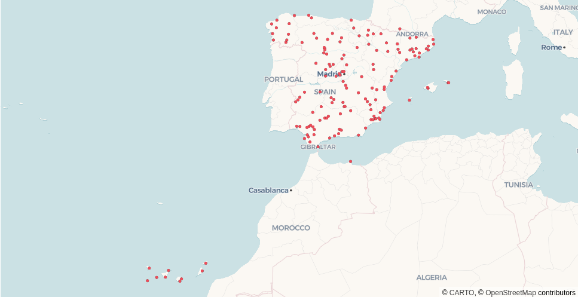

CARTO Layer
===========

CartoLayer renders cloud data from any connection (BigQuery, Snowflake, Redshift, Postgres, Databricks). It's a wrapper over the `CartoLayer in deck.gl <https://deck.gl/docs/api-reference/carto/carto-layer>`_.

Pydeck-carto is a package outside of pydeck, so calling :meth:`pydeck_carto.register_carto_layer` is required to register CartoLayer in pydeck.

Example
^^^^^^^

.. code-block:: python

    import pydeck as pdk
    from carto_auth import CartoAuth
    from pydeck_carto import register_carto_layer, get_layer_credentials
    from pydeck_carto.layer import MapType, CartoConnection

    # Authentication with CARTO
    carto_auth = CartoAuth.from_oauth()

    # Register CartoLayer in pydeck
    register_carto_layer()

    # Render CartoLayer in pydeck
    layer = pdk.Layer(
        "CartoLayer",
        data="carto-demo-data.demo_tables.world_airports",
        type_=MapType.TABLE,
        connection=CartoConnection.CARTO_DW,
        credentials=get_layer_credentials(carto_auth),
        get_fill_color=[238, 77, 90],
        point_radius_min_pixels=2.5,
        pickable=True,
    )
    map_style = pdk.map_styles.ROAD
    view_state = pdk.ViewState(latitude=0, longitude=0, zoom=1)
    tooltip={"html": "<b>Name:</b> {name}", "style": {"color": "white"}}
    pdk.Deck(layer, map_style=map_style, initial_view_state=view_state, tooltip=tooltip)

.. code-block:: python

    # Render CartoLayer in pydeck:
    # - SQL query from a BigQuery connection
    layer = pdk.Layer(
        "CartoLayer",
        data="""
            SELECT a.geom, a.name
            FROM `carto-demo-data.demo_tables.world_airports` AS a,
                 `carto-do-public-data.natural_earth.geography_glo_admin0countries_410` AS g
            WHERE g.ADMIN = 'Spain' AND
                  ST_INTERSECTS(a.geom, g.geom)
        """,
        type_=MapType.QUERY,
        connection=pdk.types.String("bigquery"),
        credentials=get_layer_credentials(carto_auth),
        get_fill_color=[238, 77, 90],
        point_radius_min_pixels=2.5,
        pickable=True,
    )
    map_style = pdk.map_styles.ROAD
    view_state = pdk.ViewState(latitude=36, longitude=-7.44, zoom=4)
    tooltip = {"html": "<b>Name:</b> {name}", "style": {"color": "white"}}
    pdk.Deck(layer, map_style=map_style, initial_view_state=view_state, tooltip=tooltip)

Error management
^^^^^^^^^^^^^^^^

Any data error is displayed instead of the map to provide instant feedback about the input parameters. For example, the user is not authorized, the connection or the column names do not exist, etc.

.. figure:: images/error-message-column.png

Properties
^^^^^^^^^^

* **data**: (``str``) Either a SQL query or a name of dataset/tileset.

* **type_**: (``pydeck.types.String``) Type of the input data. It can be either QUERY, TABLE or TILESET. :meth:`pydeck_carto.layer.MapType`.

* **connection**: (``pydeck.types.String``) Name of the connection registered in the CARTO Workspace. The connection for the CARTO Data Warehouse is already defined as a constant :meth:`pydeck_carto.layer.CartoConnection`.

* **geo_column**: (``pydeck.types.String``, optional) Name of the geo_column in the CARTO platform. It also support spatial indexes (h3, quadbin) :meth:`pydeck_carto.layer.GeoColumnType`.

* **credentials**: (``dict``) Defines the app credentials to gather the information from CARTO. It is recommended to use :meth:`pydeck_carto.get_layer_credentials` to obtain automatically the token from Oauth using the `carto-auth package <https://github.com/cartodb/carto-auth>`_.

* **aggregation_exp**: (``pydeck.types.String``, optional) Aggregation SQL expression. Only used for spatial index datasets.

* **aggregation_res_level**: (``int``, optional) Aggregation resolution level. Only used for spatial index datasets, defaults to 6 for quadbins, 4 for h3.

Check the full list of `CartoLayer properties <https://deck.gl/docs/api-reference/carto/carto-layer#properties>`_.

Reference
^^^^^^^^^

.. automodule:: pydeck_carto
    :members:

.. autoclass:: pydeck_carto.layer.MapType
.. autoclass:: pydeck_carto.layer.MapType.QUERY
.. autoclass:: pydeck_carto.layer.MapType.TABLE
.. autoclass:: pydeck_carto.layer.MapType.TILESET

.. autoclass:: pydeck_carto.layer.CartoConnection
.. autoclass:: pydeck_carto.layer.CartoConnection.CARTO_DW

.. autoclass:: pydeck_carto.layer.GeoColumnType
.. autoclass:: pydeck_carto.layer.GeoColumnType.H3
.. autoclass:: pydeck_carto.layer.GeoColumnType.QUADBIN
