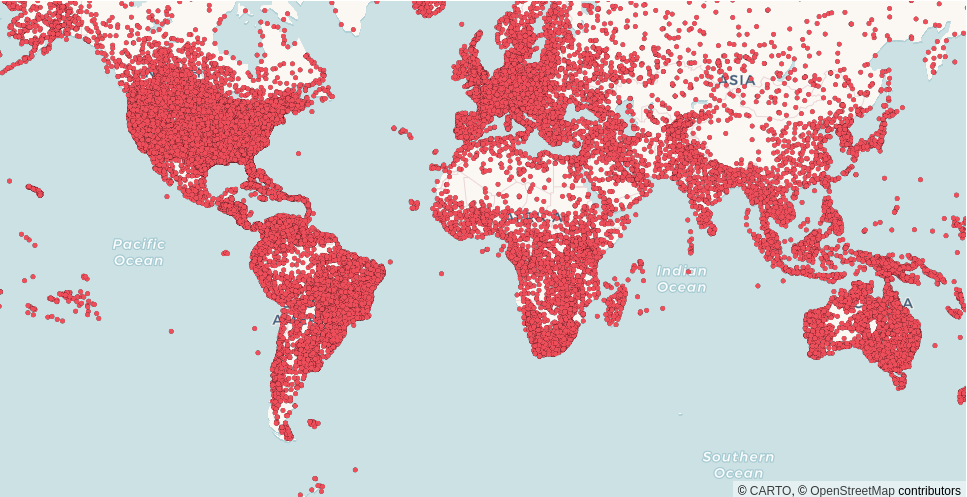
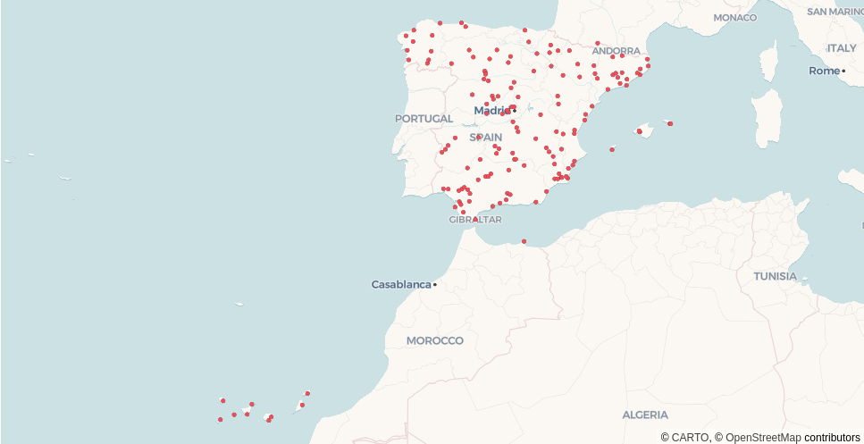
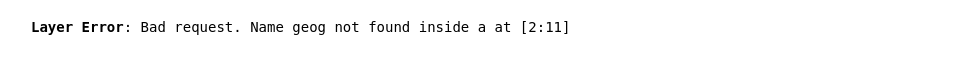

CARTO Layers
============

CARTO layers render cloud data from any connection (BigQuery, Snowflake, Redshift, Postgres, Databricks). Layer types pydeck-carto wrap the equivalent `layer types
from deck.gl <https://deck.gl/docs/api-reference/carto/overview#carto-layers>`_.

Pydeck-carto layers are not included in pydeck by default, so calling :meth:`pydeck_carto.register_layers` is required to register the CARTO layers with pydeck.

Example
^^^^^^^

.. code-block:: python

    import pydeck as pdk
    import pydeck_carto as pdkc
    from carto_auth import CartoAuth

    # Authentication with CARTO
    carto_auth = CartoAuth.from_oauth()

    # Register CARTO layers in pydeck
    pdkc.register_layers()

    # Create CARTO data source
    data = pdkc.sources.vector_query_source(
        access_token=carto_auth.get_access_token(),
        api_base_url=carto_auth.get_api_base_url(),
        connection_name="carto_dw",
        sql_query="SELECT geom, name FROM carto-demo-data.demo_tables.world_airports",
    )

    # Render CARTO layer in pydeck
    layer = pdk.Layer(
        "VectorTileLayer",
        data=data,
        get_fill_color=[238, 77, 90],
        point_radius_min_pixels=2.5,
        pickable=True,
    )

    view_state = pdk.ViewState(latitude=0, longitude=0, zoom=1)
    tooltip={"html": "<b>Name:</b> {name}", "style": {"color": "white"}}
    pdk.Deck(layer, map_style=pdk.map_styles.ROAD, initial_view_state=view_state, tooltip=tooltip)

.. code-block:: python

    # SQL query from a BigQuery connection
    data = pdkc.sources.vector_query_source(
        access_token=carto_auth.get_access_token(),
        api_base_url=carto_auth.get_api_base_url(),
        connection_name="carto_dw",
        sql_query="""
            SELECT a.geom, a.name
            FROM `carto-demo-data.demo_tables.world_airports` AS a,
                 `carto-do-public-data.natural_earth.geography_glo_admin0countries_410` AS g
            WHERE g.ADMIN = 'Spain' AND
                  ST_INTERSECTS(a.geom, g.geom)
        """,
    )

    # Render CARTO layer in pydeck
    layer = pdk.Layer(
        "VectorTileLayer",
        data=data,
        get_fill_color=[238, 77, 90],
        point_radius_min_pixels=2.5,
        pickable=True,
    )

    view_state = pdk.ViewState(latitude=36, longitude=-7.44, zoom=4)
    tooltip = {"html": "<b>Name:</b> {name}", "style": {"color": "white"}}
    pdk.Deck(layer, map_style=pdk.map_styles.ROAD, initial_view_state=view_state, tooltip=tooltip)

Error management
^^^^^^^^^^^^^^^^

Any data error is displayed instead of the map to provide instant feedback about the input parameters. For example, the user is not authorized, the connection or the column names do not exist, etc.

Properties
^^^^^^^^^^

See deck.gl documentation for all `layer properties <https://deck.gl/docs/api-reference/carto/overview#carto-layers>`_.

VectorTileLayer
~~~~~~~~~~~~~~~

* **data**: (``pydeck-carto.types.Source``) Source created with
  :meth:`pydeck_carto.sources.vector_table_source`,
  :meth:`pydeck_carto.sources.vector_query_source`, or
  :meth:`pydeck_carto.sources.vector_tileset_source`.

H3TileLayer
~~~~~~~~~~~

* **data**: (``pydeck-carto.types.Source``) Source created with
  :meth:`pydeck_carto.sources.h3_table_source`,
  :meth:`pydeck_carto.sources.h3_query_source`, or
  :meth:`pydeck_carto.sources.h3_tileset_source`.

QuadbinTileLayer
~~~~~~~~~~~~~~~~

* **data**: (``pydeck-carto.types.Source``) Source created with
  :meth:`pydeck_carto.sources.quadbin_table_source`,
  :meth:`pydeck_carto.sources.quadbin_query_source`, or
  :meth:`pydeck_carto.sources.quadbin_tileset_source`.

Reference
^^^^^^^^^

.. automodule:: pydeck_carto
    :members:
