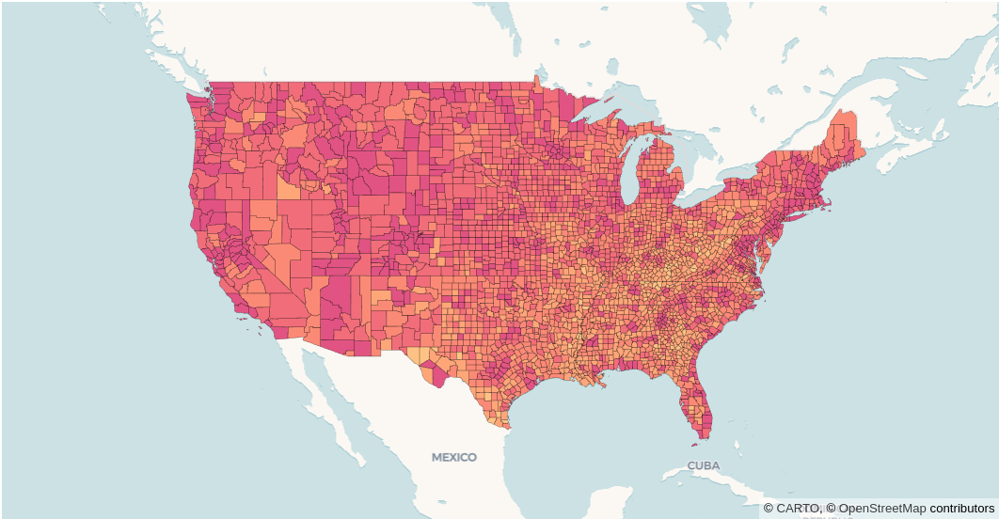

CARTO Styles
============

CARTO provides data-driven out-of-the-box styling functions for colors. Check the full list of `Carto styles in deck.gl <https://deck.gl/docs/api-reference/carto/styles>`_.

Example
^^^^^^^

.. code-block:: python

    import pydeck as pdk
    from carto_auth import CartoAuth
    from pydeck_carto import register_carto_layer, get_layer_credentials, get_error_notifier
    from pydeck_carto.layer import MapType, CartoConnection
    from pydeck_carto.styles import color_bins

    # Authentication with CARTO
    carto_auth = CartoAuth.from_oauth()

    # Register CartoLayer in pydeck
    register_carto_layer()

    # Render CartoLayer in pydeck with color_bins style
    layer = pdk.Layer(
        "CartoLayer",
        data="SELECT geom, pct_higher_ed FROM `cartobq.public_account.higher_edu_by_county`",
        type_=MapType.QUERY,
        connection=CartoConnection.CARTO_DW,
        credentials=get_layer_credentials(carto_auth),
        get_fill_color=color_bins("pct_higher_ed", [0, 20, 30, 40, 50, 60, 70], "PinkYl"),
        get_line_color=[0, 0, 0, 100],
        line_width_min_pixels=0.5,
        pickable=True,
        on_data_error=get_error_notifier(),
    )
    view_state = pdk.ViewState(latitude=38, longitude=-98, zoom=3)
    pdk.Deck(layer, map_style=pdk.map_styles.ROAD, initial_view_state=view_state)

Reference
^^^^^^^^^

.. automodule:: pydeck_carto.styles
    :members:
