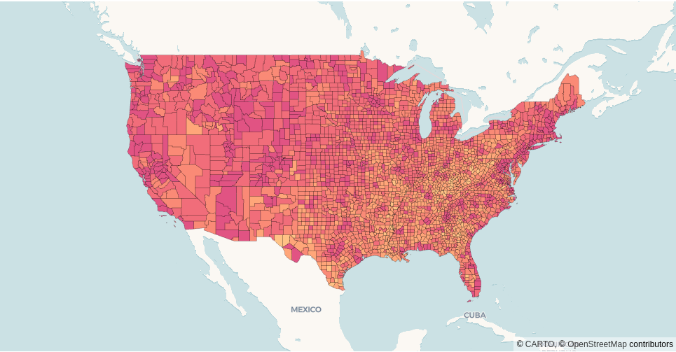
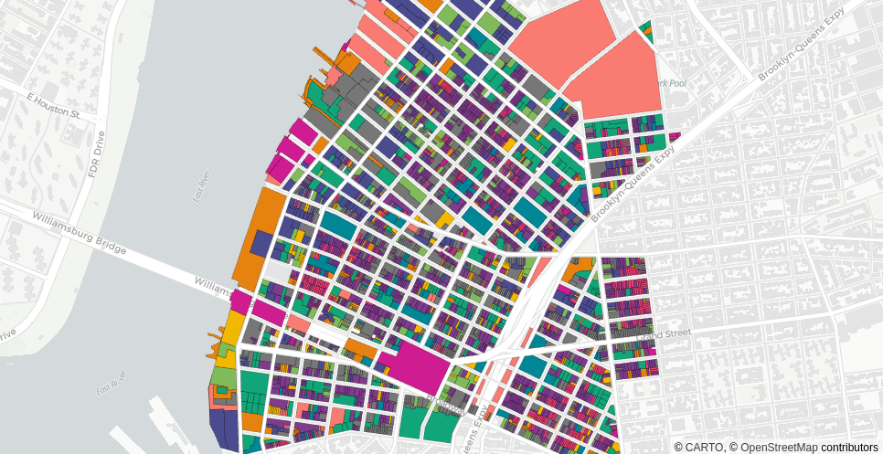
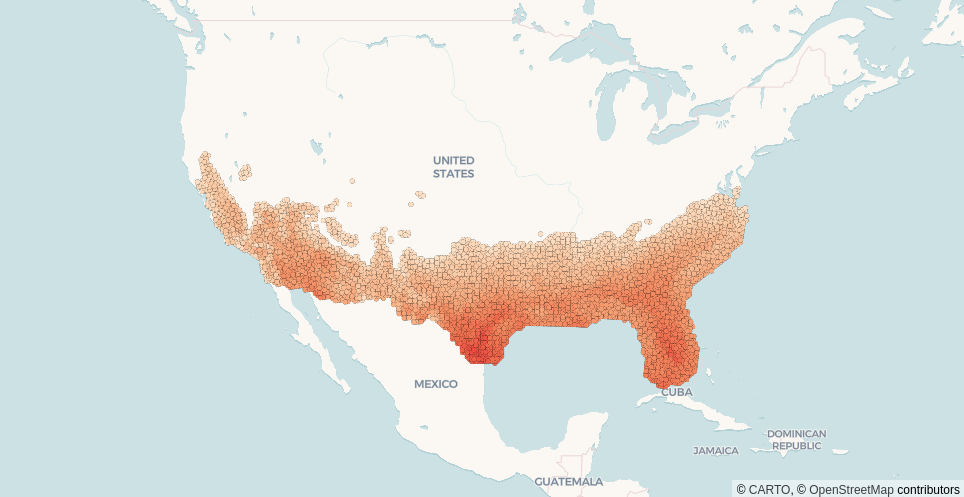

CARTO Styles
============

CARTO provides data-driven out-of-the-box styling functions for colors. Check the full list of `CARTO styles in deck.gl <https://deck.gl/docs/api-reference/carto/styles>`_.

Examples
^^^^^^^^

color_bins
~~~~~~~~~~

.. code-block:: python

    import pydeck as pdk
    import pydeck_carto as pdkc
    from carto_auth import CartoAuth

    # Authentication with CARTO
    carto_auth = CartoAuth.from_oauth()

    # Register CARTO layers in pydeck
    pdkc.register_layers()

    # Create CARTO data source
    data = pdkc.sources.vector_query_source(
        access_token=carto_auth.get_access_token(),
        api_base_url=carto_auth.get_api_base_url(),
        connection_name="carto_dw",
        sql_query="SELECT geom, pct_higher_ed FROM `cartobq.public_account.higher_edu_by_county`",
    )

    # Render CartoLayer in pydeck with color bins style
    layer = pdk.Layer(
        "VectorTileLayer",
        data=data
        get_fill_color=pdkc.styles.color_bins("pct_higher_ed", [0, 20, 30, 40, 50, 60, 70], "PinkYl"),
        get_line_color=[0, 0, 0, 100],
        line_width_min_pixels=0.5,
        pickable=True,
    )

    view_state = pdk.ViewState(latitude=38, longitude=-98, zoom=3)
    tooltip={"text": "Higher education percentage: {pct_higher_ed} %"}
    pdk.Deck(layer, map_style=pdk.map_styles.ROAD, initial_view_state=view_state, tooltip=tooltip)

color_categories
~~~~~~~~~~~~~~~~

.. code-block:: python

    # Create CARTO data source
    data = pdkc.sources.vector_query_source(
        access_token=carto_auth.get_access_token(),
        api_base_url=carto_auth.get_api_base_url(),
        connection_name="carto_dw",
        sql_query="SELECT geom, landuse_type FROM `cartobq.public_account.wburg_parcels`",
    )

    # Render CARTO layer in pydeck with color categories style
    layer = pdk.Layer(
        "VectorTileLayer",
        data=data,
        get_fill_color=color_categories(
            "landuse_type",
            [
                "Multi-Family Walk-Up Buildings",
                "Multi-Family Elevator Buildings",
                "Mixed Residential And Commercial Buildings",
                "Parking Facilities",
                "1 and 2 Family Buildings",
                "Commercial and Office Buildings",
                "Vacant Land",
                "Public Facilities and Institutions",
                "Transportation and Utility",
                "Open Space and Outdoor Recreation",
                "Industrial and Manufacturing",
            ],
            "Bold",
        ),
        get_line_color=[0, 0, 0, 100],
        line_width_min_pixels=0.5,
        pickable=True,
    )

    map_style = pdk.map_styles.ROAD
    view_state = pdk.ViewState(latitude=40.715, longitude=-73.959, zoom=14)
    tooltip={
        "html": "<b>Land use type:</b> {landuse_type}",
        "style": {"color": "black", "backgroundColor": "#84D2F6"}
    }
    pdk.Deck(layer, map_style=map_style, initial_view_state=view_state, tooltip=tooltip)

color_continuous
~~~~~~~~~~~~~~~~

.. code-block:: python

    # Create CARTO data source
    data = pdkc.sources.vector_query_source(
        access_token=carto_auth.get_access_token(),
        api_base_url=carto_auth.get_api_base_url(),
        connection_name="carto_dw",
        sql_query="SELECT geom, value FROM cartobq.public_account.temps",
    )

    # Render CartoLayer in pydeck with color continuous style
    layer = pdk.Layer(
        "VectorTileLayer",
        data=data,
        get_fill_color=color_continuous("value", [70, 75, 80, 85, 90, 95, 100], "Peach"),
        point_radius_min_pixels=2.5,
        pickable=True,
    )

    map_style = pdk.map_styles.ROAD
    view_state = pdk.ViewState(latitude=34, longitude=-98, zoom=3)
    tooltip={
        "html": "<b>Temperature:</b> {value}°F",
        "style": {"color": "white"}
    }
    pdk.Deck(layer, map_style=map_style, initial_view_state=view_state, tooltip=tooltip)

Reference
^^^^^^^^^

.. automodule:: pydeck_carto.styles
    :members:
