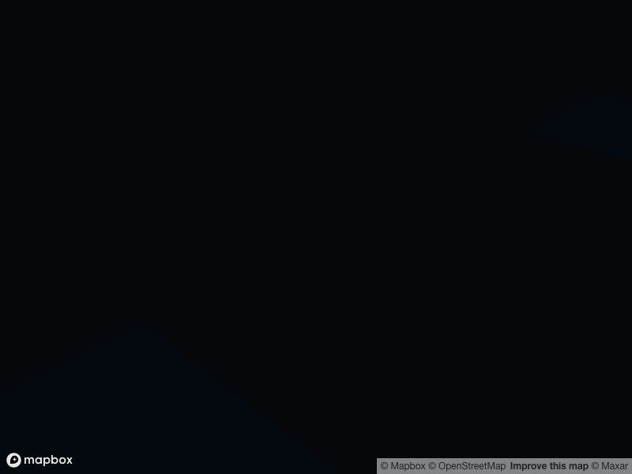

Custom layers
=============

Custom deck.gl layers are available in pydeck, loaded dynamically.

Layers are loaded dynamically by the frontend, when the output from
:meth:`pydeck.bindings.deck.Deck.show` or :meth:`pydeck.bindings.deck.Deck.to_html` is called and loaded.
Register a library with ``pydeck.settings.register_library(name, uri)`` or by setting
``pydeck.settings.custom_libraries`` directly. Once loaded, the library's uppercase-named exports (layers,
extensions, widgets, ...) are available as ``@@type`` values, for example ``pydeck.Layer("TagmapLayer", ...)``.

Custom layers must subclass deck.gl's ``Layer`` or ``CompositeLayer`` classes and must be built against the
deck.gl that is already loaded on the page: mark ``@deck.gl/*`` and ``@luma.gl/*`` as externals and read them
from the ``deck`` and ``luma`` globals that pydeck's bundle exposes. A bundle that carries its own copy of
deck.gl makes ``instanceof`` checks fail, and its layers are silently dropped.

Classic script bundles
^^^^^^^^^^^^^^^^^^^^^^

A UMD or IIFE bundle is loaded with a ``<script>`` tag and must assign ``window[libraryName]`` itself.
You can see `this repo <https://github.com/ajduberstein/pydeck_custom_layer>`__ for a minimal example
(webpack with deck.gl as an external mapped to the ``deck`` global):

.. literalinclude:: ../examples/custom_layer.py
   :language: python

ES module bundles
^^^^^^^^^^^^^^^^^

Libraries published as ES modules (files with ``export`` statements) are loaded with ``module=True``. pydeck
imports the module with ``<script type="module">`` and exposes its namespace as ``window[libraryName]``:

.. code-block:: python

   import pydeck

   pydeck.settings.register_library("MyLayers", "https://example.com/my-layers.mjs", module=True)
   layer = pydeck.Layer("MyLayer", data)  # MyLayers exports MyLayer

The module must be served with a JavaScript MIME type and CORS headers, and must not bundle its own copy of
deck.gl. With esbuild, alias the deck.gl packages to small shims that re-export from the page globals:

.. code-block:: bash

   npx esbuild src/index.ts --bundle --format=esm --outfile=dist/my-layers.mjs \
     --alias:@deck.gl/core=./shims/deck-core.js --alias:@deck.gl/layers=./shims/deck-layers.js

.. code-block:: javascript

   // shims/deck-core.js -- list only what you import
   export const {Layer, CompositeLayer, project32, picking} = globalThis.deck;
   // shims/deck-layers.js
   export const {ScatterplotLayer, PathLayer} = globalThis.deck;

deck.gl-community layers
^^^^^^^^^^^^^^^^^^^^^^^^

The `deck.gl-community <https://visgl.github.io/deck.gl-community/docs>`__ layer packs
(``@deck.gl-community/graph-layers``, ``infovis-layers``, ``timeline-layers``, ``editable-layers`` and
others) are published as ES modules only and, as of their 9.3 releases, depend on deck.gl ``~9.3`` while
pydeck ships deck.gl 9.4. Loading them straight from a CDN such as esm.sh with ``module=True`` executes, but
the CDN bundles a second deck.gl and luma.gl, so their layers are dropped by the JSON converter. Until those
packages publish browser bundles externalized against the ``deck`` global (tracked in
`deck.gl #10454 <https://github.com/visgl/deck.gl/issues/10454>`__), use them from pydeck by building such a
bundle yourself with the recipe above.
