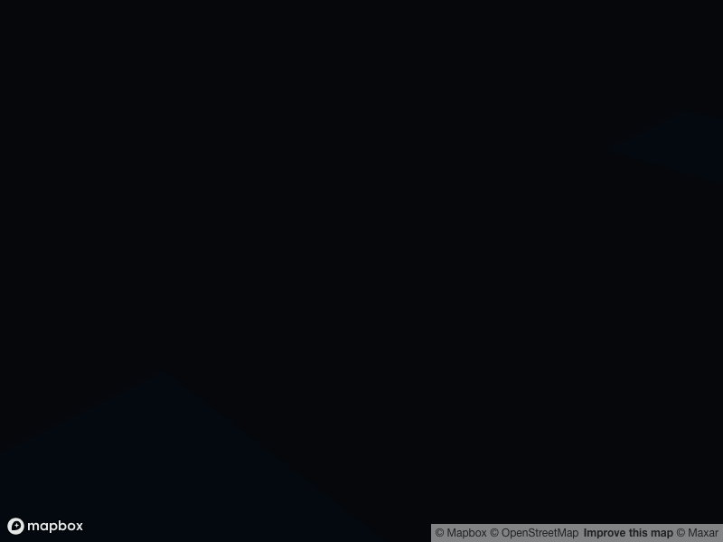

Custom layers
=============

Custom deck.gl layers are available in pydeck, loaded dynamically.

Layers are loaded dynamically by the frontend, when the output from
:meth:`pydeck.bindings.deck.Deck.show` or :meth:`pydeck.bindings.deck.Deck.to_html` is called and loaded.
Register a library with ``pydeck.settings.register_library(name, uri)`` or by setting
``pydeck.settings.custom_libraries`` directly. Once loaded, the library's uppercase-named exports (layers,
extensions, widgets, ...) are available as ``@@type`` values, for example ``pydeck.Layer("TagmapLayer", ...)``.

Custom layers must subclass deck.gl's ``Layer`` or ``CompositeLayer`` classes and must be built against the
deck.gl that is already loaded on the page: mark ``@deck.gl/*`` and ``@luma.gl/*`` as externals and read them
from the ``deck`` and ``luma`` globals that pydeck's bundle exposes. A bundle that carries its own copy of
deck.gl makes ``instanceof`` checks fail, and its layers are silently dropped.

Classic script bundles
^^^^^^^^^^^^^^^^^^^^^^

A UMD or IIFE bundle is loaded with a ``<script>`` tag and must assign ``window[libraryName]`` itself.
You can see `this repo <https://github.com/ajduberstein/pydeck_custom_layer>`__ for a minimal example
(webpack with deck.gl as an external mapped to the ``deck`` global):

.. literalinclude:: ../examples/custom_layer.py
   :language: python

ES module bundles
^^^^^^^^^^^^^^^^^

Libraries published as ES modules (files with ``export`` statements) are loaded with ``module=True``. pydeck
imports the module with ``<script type="module">`` and, unless that global already exists, exposes its
namespace as ``window[libraryName]``:

.. code-block:: python

   import pydeck

   pydeck.settings.register_library("MyLayers", "https://example.com/my-layers.mjs", module=True)
   layer = pydeck.Layer("MyLayer", data)  # MyLayers exports MyLayer

The module must be served with a JavaScript MIME type and CORS headers, and must not bundle its own copy of
deck.gl. With esbuild, alias the deck.gl packages to small shims that re-export from the page globals:

.. code-block:: bash

   npx esbuild src/index.ts --bundle --format=esm --outfile=dist/my-layers.mjs \
     --alias:@deck.gl/core=./shims/deck-core.js --alias:@deck.gl/layers=./shims/deck-layers.js

.. code-block:: javascript

   // shims/deck-core.js -- list only what you import
   export const {Layer, CompositeLayer, project32, picking} = globalThis.deck;
   // shims/deck-layers.js
   export const {ScatterplotLayer, PathLayer} = globalThis.deck;

Importing deck.gl by package name (experimental)
^^^^^^^^^^^^^^^^^^^^^^^^^^^^^^^^^^^^^^^^^^^^^^^^

ES module libraries can also import these packages by name, and receive the copies already loaded by pydeck:

``@deck.gl/core``, ``@deck.gl/layers``, ``@deck.gl/extensions``, ``@deck.gl/aggregation-layers``,
``@deck.gl/geo-layers``, ``@deck.gl/mesh-layers``, ``@deck.gl/widgets``, ``@luma.gl/core``,
``@luma.gl/engine``, ``@luma.gl/shadertools`` (and ``/wgsl``), ``@luma.gl/webgl`` (and ``/constants``),
``@loaders.gl/core`` and ``@math.gl/core``.

Before it loads the first ``module=True`` library, pydeck adds an
`import map <https://developer.mozilla.org/en-US/docs/Web/HTML/Element/script/type/importmap>`__ that
resolves each name to pydeck's copy. A library built with these packages as externals needs no shims:

.. code-block:: python

   import pydeck

   # my-layers.js starts with: import {CompositeLayer} from '@deck.gl/core';
   pydeck.settings.register_library("MyLayers", "https://example.com/my-layers.js", module=True)

To load a package published to npm, pass ``npm`` instead of a URL. pydeck loads it from
`esm.sh <https://esm.sh>`__, which bundles the package's other dependencies and leaves the packages above for
pydeck to provide:

.. code-block:: python

   pydeck.settings.register_library(npm="@deck.gl-community/layers")
   layer = pydeck.Layer("PathOutlineLayer", data, get_path="path", get_color=[255, 0, 0], get_width=30)

``npm`` takes an optional version range, such as ``"my-layers@^1.2"``. A ``@deck.gl-community`` package
without one loads the release for pydeck's deck.gl version (9.4 for pydeck 0.9.4). A library must target the
same deck.gl minor version as pydeck, and pydeck warns when a ``@deck.gl-community`` version does not match.

To use another CDN, such as a self-hosted esm.sh, set ``pydeck.settings.esm_cdn`` before registering. It must
support esm.sh's ``?external=`` parameter. CDNs that rewrite every import, such as jsDelivr's ``+esm``, load
a second copy of deck.gl and do not work.

This is experimental and may change in a later release.

To use layers and extensions from deck.gl-community, see :doc:`community_libraries`.
