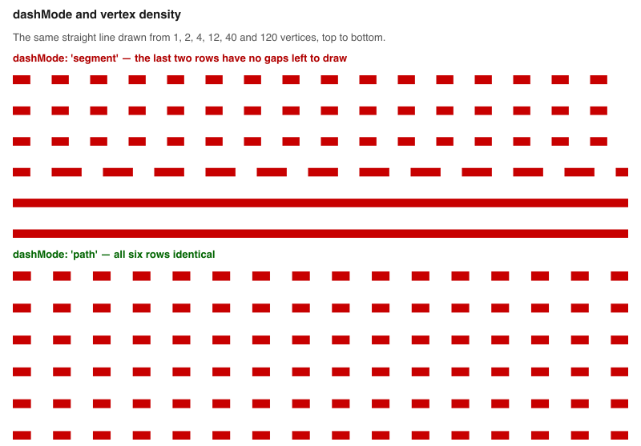

# RFC: Stable dash patterns for PathStyleExtension

* Authors: Chris Gervang
* Date: August, 2026
* Status: **Draft**

## Summary

- **New:** `dashMode` selects whether pattern phase restarts at each source segment or continues
  across the complete path. Path mode keeps phase stable when geometry is resampled.
- **New:** `dashUnits` selects whether pattern lengths scale with stroke width, remain fixed in
  screen pixels, represent meters, or use common-space units. This makes zoom behavior explicit.
- **Fixed automatically:** Existing dashed paths now keep coherent phase and coverage across
  elevation, billboard extrusion, offsets, long paths, and subpixel patterns. These repairs do not
  require application changes.
- **Existing and composable:** `dashJustified` still fits periods to endpoints, and `getOffset`
  still places parallel strokes around one centerline. Both compose with the new controls.
- **Deprecated:** `highPrecisionDash` remains compatible as an alias for `dashMode: 'path'`.
- **Unchanged defaults:** Omitting the new options preserves segment phase and width-relative dash
  lengths.

Together, these changes let a simple path express screen-space symbols, physical repetition,
fitted edge patterns, and parallel strokes while retaining the existing mode and unit defaults.

## Motivation and background

Dashes commonly encode planned, uncertain, hidden, intermittent, or unavailable states. They
also represent repeated physical structure, such as lane markings or railway ties. In either
case, the pattern must retain its meaning as geometry is resampled, the camera zooms, or the path
moves through three dimensions. A dash is therefore a property of the stroke, not of the
incidental tessellation used to draw it.

`PathLayer` gives the fragment shader an along-segment coordinate that restarts at every vertex,
and the dash shader tests `mod(alongSegment + offset, unitLength)` against the dash size. With
`offset` fixed at zero, the pattern restarts at every vertex too. Once a segment is no longer than
the solid dash interval, the modulo never reaches the gap, no fragment is discarded, and the path
renders as a solid line.

Six strips drawing the *identical* straight line, differing only in how many segments it is built
from, with `getDashArray: [4, 5]` on a 10px stroke:

| segments | 1 | 2 | 4 | 12 | 40 | 120 |
| --- | --- | --- | --- | --- | --- | --- |
| measured dash period | 43.4px | 43.4px | 43.4px | 55.4px | **solid** | **solid** |



This is common with GPS traces, generalized coastlines, routing output, and circles or arcs
approximated by short chords. It is also confusing to diagnose because zooming in eventually
makes segments long relative to a width-relative pattern and the gaps reappear.

`dashJustified` does not make segment phase continuous. It fits each segment independently, so
the same dense geometry can still appear solid.

### What already exists

`highPrecisionDash` is an existing opt-in that accumulates distance from the start of the path on
the CPU in `getDashOffsets`, stores it in a vertex attribute, and uses it as dash phase. On the six
strips above it produces six identical patterns.

The mechanism works, but the old API and implementation have several shortcomings:

- **The name describes an implementation rather than an outcome.** “High precision” does not say
  that phase continues across source vertices.
- **The behavior is hard to discover.** Existing documentation leads with cost rather than the
  type of path that needs it.
- **It was mutually exclusive with `dashJustified`.** Justification overrode continuous phase.
- **It was unreliable in important configurations.** Billboard extrusion, elevation, offsets,
  long accumulated paths, and subpixel patterns exposed independent rendering defects addressed
  in the surrounding v9.4 work.
- **Pattern length was only stroke-relative.** A screen-space symbol or physical interval could
  not be expressed independently of stroke width.

## Design model

Path styling is easier to reason about as four independent questions:

| Design dimension | API |
| --- | --- |
| Phase domain: where does repetition continue? | `dashMode` |
| Length measure: what does one pattern unit mean? | `dashUnits` |
| Endpoint fitting: should a run finish cleanly? | `dashJustified` |
| Parallel placement: where is the stroke relative to its centerline? | existing `getOffset` |

### Phase domain

`dashMode: 'segment'` makes every source vertex an intentional pattern boundary. This is useful
for independent polygon edges or structural panels and avoids CPU distance accumulation.

`dashMode: 'path'` treats source vertices as tessellation points inside one conceptual stroke. A
route, trace, or trajectory then retains one phase as geometry is densified, simplified, or
resampled.

### Length measure

`dashUnits` separates pattern length from phase. Stroke-relative units express a visual line
style, pixels express screen-space symbology, meters express physical repetition, and common
units express application common-coordinate-space measurements.

These choices intentionally behave differently under zoom. The API makes that choice explicit;
it does not force every pattern to remain the same size on screen.

### Endpoint fitting

`dashJustified` adjusts the gap so a whole number of periods spans the active run, with a
half-dash centered at each endpoint. The active run follows `dashMode`: one source segment or the
complete path. Because fitting can lengthen or shorten gaps, it is not appropriate when exact
measured spacing must be preserved.

### Parallel placement

`getOffset` is not changed by this RFC, but it belongs to the same stroke model. A path may be
repeated on either side of its centerline, and dash phase and period must remain consistent on the
offset geometry. The v9.4 alignment fixes make that composition reliable.

## API proposal

### `dashMode`

A constructor option on `PathStyleExtension`:

```js
new PathStyleExtension({dashMode: 'path'});
```

| value | behavior |
| --- | --- |
| `'segment'` (default) | The pattern restarts at every source vertex. |
| `'path'` | The pattern runs continuously from the start of each path. |

Supplying either mode enables dashing. Omitting `dashMode` keeps the resolved phase mode at
`'segment'` but does not enable the dash capability unless `dash: true` or
`highPrecisionDash: true` is supplied. This preserves offset-only construction.

`'segment'` remains the default because it preserves existing output, needs no CPU pass, and
allocates no path-distance attribute. Changing the default would impose both cost and output
changes on existing users.

`dashMode` is a constructor option rather than a layer prop because `'path'` allocates a vertex
attribute. Attributes are declared in `initializeState` before layer props are read.

### `dashJustified` composition

The run fitted by justification follows `dashMode`:

| mode | run being fitted |
| --- | --- |
| `dashMode: 'segment'` | each source segment |
| `dashMode: 'path'` | the complete path |

Per-segment fitting gives intentional corners well-defined boundaries but may choose a different
gap for every segment. Whole-path fitting uses one period across interior vertices while still
finishing cleanly at the path endpoints.

### `highPrecisionDash` deprecation

`highPrecisionDash` becomes an alias for `dashMode: 'path'` and continues to work. The new name
describes the phase domain instead of the implementation mechanism.

### `dashUnits`

A layer prop selects what `getDashArray` measures:

| value | one dash unit is |
| --- | --- |
| `'widths'` (default) | half the effective stroke width |
| `'pixels'` | one screen pixel |
| `'meters'` | one meter in the layer's geospatial coordinate system |
| `'common'` | one deck.gl common-coordinate-space unit |

`getDashArray` has historically been relative to half the stroke width. This remains a useful
default because the pattern scales with the line. With the `PathLayer` default of
`widthUnits: 'meters'`, both the stroke and a width-relative pattern grow on screen as the user
zooms in.

Measured on a stroke with `widthUnits: 'meters'`:

| `dashUnits` | z12 | z13 | z14 |
| --- | --- | --- | --- |
| `'widths'` | 17.6px | 34.7px | 67.9px |
| `'pixels'` | 43.6px | 43.6px | 43.6px |

Both results are intentional. Widths are appropriate when dashes belong to the line style;
pixels are appropriate when the pattern is a screen-space symbol. Meters and common units cover
physical and application-coordinate measurements.

`dashUnits` is a layer prop because it is uniform-driven, allocates no attribute, and may vary per
frame.

The prop applies to `PathLayer` and composites that render paths. `ScatterplotLayer` outlines and
`TextLayer` backgrounds use separate signed-distance-field shaders and remain width-relative.

## Compatibility and migration

The additions are backward compatible. `dashMode` resolves to `'segment'` when omitted,
`dashUnits` defaults to `'widths'`, and `highPrecisionDash` remains supported. Existing users do
not need to opt into the automatic billboard, 3D, offset, long-path, justification, or coverage
fixes.

Applications that compare stored images may need to regenerate affected screenshots because the
automatic fixes can change pixels while preserving the intended style.

One internal change widens `instanceDashOffsets` from a `float` to a `vec2` containing distance
from the path start and total path length. A `vec2` still occupies one vertex attribute slot, so
the WebGL attribute ceiling is unchanged.

## Prior art

**MapLibre / Mapbox** accumulate distance along each line on the CPU and encode `linesofar` in
vertex data. Their line dash arrays are width-relative and continuous along line geometry. A
renderer focused on tiled line data does not need deck.gl's intentional per-segment mode; deck.gl
accepts arbitrary application paths and retains both phase domains.

**SVG** repeats `stroke-dasharray` continuously along each subpath. A new subpath resets the
pattern, but vertices within one polyline do not. This matches `dashMode: 'path'` for one deck.gl
path.

Both systems establish continuous path phase as the common author expectation. deck.gl keeps
segment phase for data whose source vertices are meaningful boundaries.

## Alternatives considered

**Make `'path'` the default.** This matches comparable renderers and handles resampled paths well,
but every dashed layer would pay for a CPU pass and another vertex attribute. It would also change
existing output. Rejected for a compatible release.

**Change segment mode so short segments never appear solid.** Restarting a pattern at every
vertex is coherent behavior when those vertices are intended boundaries. The issue is choosing
the wrong phase domain, not an invalid segment implementation.

**Derive complete-path distance on the GPU.** The vertex shader sees the current segment, not a
prefix sum over the path. A compute pass could supply one on WebGPU but would not support WebGL2 or
remove the result attribute.

**Name the option `dashContinuous: boolean`.** A named phase domain composes more clearly with
justification and leaves room for future modes.

**Keep the name `highPrecisionDash`.** The behavior is about phase domain rather than numeric
precision, and the old name makes the intended use difficult to discover.

**Reuse deck.gl's existing `Unit` type.** `Unit` contains `'meters'`, `'common'`, and `'pixels'`
but cannot express the existing stroke-relative behavior. Extending it with `'widths'` would add a
meaningless value to unrelated unit props.

**Use a boolean such as `dashScreenSpace`.** A boolean covers widths and pixels but cannot express
meters or common units.

## Implementation and testing notes

### Coordinate conversion

CPU path distance is accumulated in common space, flat and billboard extrusion meet in screen
pixels, and the fragment shader tests a coordinate normalized by half-width. The shader first
computes how many screen pixels one along-path coordinate unit spans, converts the selected dash
unit into pixels, and divides the two. This keeps unit conversion independent of extrusion branch.

Long-path phase is reduced modulo the active period in the vertex shader before it is combined
with the smaller segment-local coordinate. This avoids Float32 cancellation at high zoom.

### Figures

The figures in the extension docs are generated from render-test goldens by
`scripts/dash-figures/compose.mjs`, so a published figure is tied to tested output. Before/after
panels come from `scripts/dash-figures/capture-before.sh`, which temporarily replaces only the
three behavior-carrying sources and renders the current scenes. Both sides therefore use identical
geometry and test configuration.

### Performance benchmarks

The benchmark suite includes two standalone pages for identifying major extension costs:

- `test/bench/path-style-extension-cpu.html` measures continuous-path phase generation for
  100,000 segments. Segment mode is the control because it performs no CPU phase pass.
- `test/bench/path-style-extension.html` uses WebGL2 timestamp queries at 3840 by 2160 pixels. It
  compares plain paths, segment dashing, path dashing, alternate units, justification, and offset
  capability across a sparse workload and a deliberately fragment-heavy workload.

In one 20-sample run on an Apple M1 Max through ANGLE Metal, enabling segment dashing added about
8% to the median GPU time for 100,000 sparse strokes and 43% for 256 overlapping 64-pixel strokes.
The new path, units, justification, and offset controls added no more than 4% beyond segment
dashing in those workloads. Continuous phase generation for a 100,000-segment path took about
1.6 ms for nested XYZ positions and 3.3 ms for flat XYZ positions. These measurements are
hardware- and workload-specific; the checked-in pages are the reproducible comparison rather than
a fixed performance guarantee.

### Render coverage

`test/render/test-cases/path-dash.spec.ts` covers:

- identical paths at six vertex densities;
- all four `dashMode` and `dashJustified` combinations;
- width-, pixel-, meter-, and common-unit patterns;
- flat and billboard extrusion across zoom;
- 3D arclength and joints;
- offset phase and period;
- long paths, fine patterns, rounded ends, and picking.

One test-harness detail is important: pixelmatch excludes antialiased pixels from mismatch counts
unless `includeAA` is enabled. Horizontal dash ends can also land on exact pixel columns and show
no partial coverage. Coverage tests therefore enable antialiased comparison and include a dense
diagonal case, ensuring a reverted prefilter fails above the mismatch threshold.

## Limitations and future work

- **WebGPU.** `PathStyleExtension` injects GLSL and has no WGSL implementation.
- **SDF-backed outlines.** `ScatterplotLayer` and `TextBackgroundLayer` remain width-relative and
  do not expose these path-specific phase or fitting controls.
- **One interval pair.** `getDashArray` represents one `[dash, gap]` pair, not an arbitrary
  multi-phase dash-dot sequence.
- **Attribute budget.** Path-continuous phase consumes one vertex attribute in addition to the
  dash-array and offset attributes.
- **Very long paths.** Vertex-shader phase reduction removes the practical local-coordinate
  freeze, but CPU distance still accumulates in Float32 storage.

Potential follow-up work, without commitment in this RFC:

- absolute `offsetUnits` for rail gauges, shoulders, and corridor edges;
- arbitrary repeating interval arrays for multi-phase patterns;
- WGSL support for `PathStyleExtension`;
- absolute units for SDF-backed ScatterplotLayer and TextBackgroundLayer outlines;
- reusable repeated-symbol strokes beyond rectangular dash fragments.
