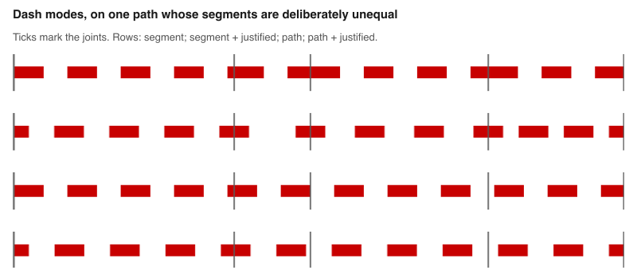
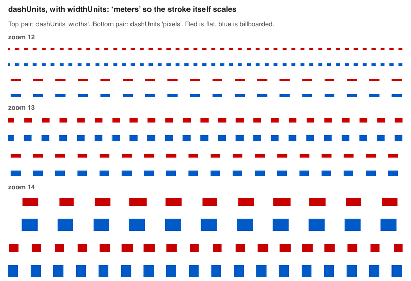
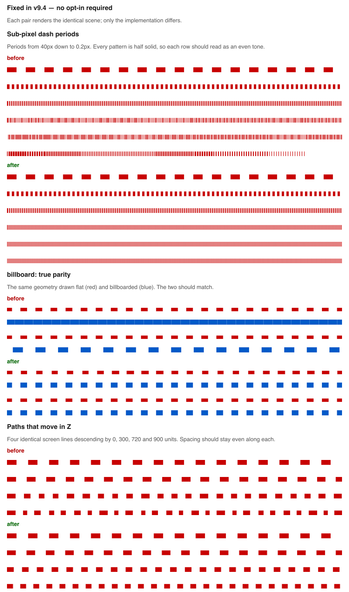

# PathStyleExtension

`PathStyleExtension` turns a path into a configurable stroke. A repeating pattern can restart
at each source segment or continue across the whole path; its dimensions can scale with the
stroke, remain fixed on screen, be measured in meters, or use deck.gl common-space units; the
pattern can be fitted to its endpoints; and the stroke can be shifted to either side of its
centerline.

These choices support planned or uncertain routes, hidden or interrupted alignments, physical
markings and repeated structures, parallel lanes and rails, and familiar plotting line styles.
In v9.4, these controls and rendering fixes keep stroke semantics reliable across dense geometry,
zoom, elevation, billboard extrusion, offsets, and long paths.

The extension supports [PathLayer](../layers/path-layer.md) and composite layers that render paths,
including [PolygonLayer](../layers/polygon-layer.md) and [GeoJsonLayer](../layers/geojson-layer.md).
Its dash capability also supports [ScatterplotLayer](../layers/scatterplot-layer.md) outlines and
[TextLayer](../layers/text-layer.md) backgrounds, subject to the limitations below.

> Note: In v8.0, the `getDashArray` and `dashJustified` props were removed from `PathLayer` and
> moved into this extension.

<div style={{position:'relative',height:450}}></div>
<div style={{position:'absolute',transform:'translateY(-450px)',paddingLeft:'inherit',paddingRight:'inherit',left:0,right:0}}>
  <iframe height="450" style={{width:'100%'}} scrolling="no" title="deck.gl PathStyleExtension" src="https://codepen.io/vis-gl/embed/dyOMaoX?height=450&theme-id=light&default-tab=result" frameborder="no" loading="lazy" allowtransparency="true" allowfullscreen="true">
    See the Pen <a href='https://codepen.io/vis-gl/pen/dyOMaoX'>deck.gl PathStyleExtension</a> by vis.gl
    (<a href='https://codepen.io/vis-gl'>@vis-gl</a>) on <a href='https://codepen.io'>CodePen</a>.
  </iframe>
</div>

```js
import {PolygonLayer} from '@deck.gl/layers';
import {PathStyleExtension} from '@deck.gl/extensions';

const layer = new PolygonLayer({
  id: 'polygon-layer',
  data,
  // ...
  getDashArray: [3, 2],
  dashJustified: true,
  dashGapPickable: true,
  extensions: [new PathStyleExtension({dash: true})]
});
```

## Design a stroke

| Design question | API |
| --- | --- |
| What repeats along the stroke? | `getDashArray` |
| Over what run does the pattern phase continue? | `dashMode` |
| What does one dash unit mean? | `dashUnits` |
| Should the pattern fit its endpoints? | `dashJustified` |
| Where is the stroke relative to its centerline? | `getOffset` |
| Should gaps be part of the interactive object? | `dashGapPickable` |

## Common stroke recipes

| Intent | Extension options | Layer properties |
| --- | --- | --- |
| Planned, uncertain, or hidden route | `{dashMode: 'path'}` | `dashUnits: 'pixels'` |
| Physical lane marks, railway ties, or measured intervals | `{dashMode: 'path'}` | `dashUnits: 'meters'` |
| Patterned edges whose vertices are intentional boundaries | `{dashMode: 'segment'}` | `dashJustified: true` |
| One pattern fitted across a complete route | `{dashMode: 'path'}` | `dashJustified: true` |
| Parallel rails, lanes, shoulders, or casings | `{offset: true}` | `getOffset` |
| Dense GPS, routing, or XYZ paths | `{dashMode: 'path'}` | Use `billboard: true` when the stroke must face the camera |

These are starting points, not required combinations. Choose `dashUnits` from the meaning the
pattern should have, and use separate layer instances when strokes need different capabilities or
the WebGL attribute budget is tight.

## Installation

To install the dependencies from NPM:

```bash
npm install deck.gl
# or
npm install @deck.gl/core @deck.gl/layers @deck.gl/extensions
```

```js
import {PathStyleExtension} from '@deck.gl/extensions';
new PathStyleExtension({});
```

To use pre-bundled scripts:

```html
<script src="https://unpkg.com/deck.gl@^9.0.0/dist.min.js"></script>
<!-- or -->
<script src="https://unpkg.com/@deck.gl/core@^9.0.0/dist.min.js"></script>
<script src="https://unpkg.com/@deck.gl/layers@^9.0.0/dist.min.js"></script>
<script src="https://unpkg.com/@deck.gl/extensions@^9.0.0/dist.min.js"></script>
```

```js
new deck.PathStyleExtension({});
```

## Constructor

```js
new PathStyleExtension({dash, dashMode, offset, highPrecisionDash});
```

- `dash` (boolean) - add capability to render dashed lines. Default `false`.
- `dashMode` (string) - select the phase domain, one of `'segment'` and `'path'`. Supplying
  either value enables dashing. If omitted, the phase mode still defaults to `'segment'`, but
  dashing remains disabled unless `dash: true` or the deprecated `highPrecisionDash: true` is
  supplied.
- `offset` (boolean) - add capability to offset lines. Default `false`.
- `highPrecisionDash` (boolean) - **deprecated**, an alias for `dashMode: 'path'`. Default
  `false`.

## Layer Properties

When added to a layer via the `extensions` prop, `PathStyleExtension` adds the following
properties to the layer.

#### `getDashArray` ([Accessor&lt;number[2]&gt;](../../developer-guide/using-layers.md#accessors)) {#getdasharray}

Must be specified if the dash capability is enabled.

The dash array to draw each path with: `[dashSize, gapSize]` in the units selected by
`dashUnits`. By default, one unit is half the path width. A `getDashArray` of `[4, 5]` on a
10-pixel path therefore draws 20-pixel dashes separated by 25-pixel gaps.

- If an array is provided, it is used as the dash array for all paths.
- If a function is provided, it is called on each path to retrieve its dash array. Return
  `[0, 0]` to draw a solid line.
- If this accessor is not specified, all paths are drawn as solid lines.

#### `dashJustified` (boolean, optional) {#dashjustified}

- Default: `false`

Only effective if `getDashArray` is specified. If `true`, adjust the gap so a whole number of
periods spans the active run, with a half-dash centered at each endpoint. Under
`dashMode: 'segment'`, the active run is each segment. Under `dashMode: 'path'`, it is the whole
path. Because fitting changes gap length, do not use justification when exact measured spacing
must be preserved.

> Note: `dashJustified` and the selected `dashMode` phase behavior only apply to `PathLayer` and
> its composites. Supplying either `dashMode` value still enables dashing on supported
> signed-distance-field layers, but `'segment'` and `'path'` render identically there.

#### `getOffset` ([Accessor&lt;number&gt;](../../developer-guide/using-layers.md#accessors)) {#getoffset}

Must be specified if the `offset` option is enabled.

The offset at which to draw each path, expressed as a multiple of its effective width. Negative
values shift left and positive values shift right relative to path direction. `0` centers the
stroke on the source coordinates.

- If a number is provided, it is used as the offset for all paths.
- If a function is provided, it is called on each path to retrieve its offset.

#### `dashUnits` (string, optional) {#dashunits}

- Default: `'widths'`

What `getDashArray` is measured in, one of `'widths'`, `'pixels'`, `'meters'`, and `'common'`:

- **`'widths'`: the dash is part of the stroke's visual style.** One unit is half the effective
  stroke width, so the pattern scales with the line.
- **`'pixels'`: the dash is a screen-space symbol.** One unit is one screen pixel, so the
  pattern remains the same size as the user zooms.
- **`'meters'`: the dash is a physical measurement.** One unit is one meter in the layer's
  geospatial coordinate system.
- **`'common'`: the dash belongs to deck.gl common space.** One unit is one common-coordinate
  unit.

> Note: `dashUnits` applies to `PathLayer` and composite layers that render paths.
> `ScatterplotLayer` outlines and `TextLayer` backgrounds continue to interpret
> `getDashArray` relative to their stroke width.

```js
// A 20px dash and a 25px gap, unchanging as the user zooms
new PathLayer({
  // ...
  widthUnits: 'meters',
  getWidth: 60,
  getDashArray: [20, 25],
  dashUnits: 'pixels',
  extensions: [new PathStyleExtension({dashMode: 'path'})]
});
```

#### `dashGapPickable` (boolean, optional) {#dashgappickable}

- Default: `false`

Only effective if `getDashArray` is specified. If `true`, gaps between solid strokes are
pickable, making the complete patterned stroke one interactive object. If `false`, only solid
parts are pickable.

## Stroke behavior

### Segment and path phase

`dashMode` selects the run over which the pattern's phase continues, while `dashJustified`
selects whether the pattern is fitted to the endpoints of that run. They compose into four
states.



All four rows draw one path whose segments are deliberately unequal, with joints marked by
ticks. From top to bottom: `'segment'` begins a new pattern at every joint; justified segment
mode centers a half-dash on every joint; and the two `'path'` rows continue through the joints
because their phase follows the complete path.

#### `dashMode: 'segment'` (default)

Use segment mode when source vertices are intentional pattern boundaries, such as independent
polygon edges or structural panels. The pattern restarts at every vertex, so each segment is
styled as its own run.

This is also the cheaper mode: it needs no CPU distance accumulation or path-distance attribute.
It is not suitable when vertices merely tessellate one conceptual stroke and may be dense,
simplified, or resampled. A segment no longer than `dashSize` never reaches a gap and therefore
appears solid.

#### `dashMode: 'path'`

Use path mode when the data describes one conceptual stroke. The pattern runs continuously from
the start of the path, making source vertices an implementation detail. Routes, GPS traces,
railway alignments, and XYZ trajectories therefore retain the same phase when densified,
simplified, or resampled.


Both halves of this figure draw the same straight line six times, using 1, 2, 4, 12, 40, and
120 segments. Under `'segment'`, the last two rows contain no gaps and appear solid. Under
`'path'`, all six rows are identical.

Path mode costs a CPU pass over the geometry to accumulate distance and one additional vertex
attribute.

#### Endpoint fitting with `dashJustified`

Justification adjusts the gap so a whole number of periods spans the active run. Segment mode
fits each segment independently, which gives intentional corners clean boundaries but can make
gaps vary from segment to segment. Path mode fits once across the complete path, keeping one
period across interior vertices. Fitting can lengthen or shorten gaps and is therefore distinct
from exact physical spacing.

### Choosing dash units

Choose units from the meaning the pattern should retain. Use `'widths'` when it is part of the
line's visual style, `'pixels'` for screen-space symbology, `'meters'` for a physical interval,
and `'common'` for application common-space measurements.



Every row in the figure uses `widthUnits: 'meters'`. The `'widths'` pairs grow on screen with
the stroke, while the `'pixels'` pairs hold the same period at z12, z13, and z14. Red paths are
flat, blue paths are billboarded, and each pair agrees.

### Parallel strokes from one centerline

`getOffset` shifts a rendered stroke to either side of its source path. Reusing one authoritative
centerline lets an application construct parallel rails, lanes, shoulders, buffers, or casings
without editing the source coordinates.

Offsets are multiples of the effective stroke width. To express an absolute lateral distance,
divide that distance by the effective stroke width. Use separate layer instances when center and
offset strokes need different widths, colors, patterns, or extension attribute budgets.

```js
import {PathLayer} from '@deck.gl/layers';
import {PathStyleExtension} from '@deck.gl/extensions';

const centerline = [
  [-122.45, 37.78],
  [-122.44, 37.79]
];
const railWidthMeters = 0.12;
const railGaugeMeters = 1; // Illustrative dimensions, not sourced measurements
const rails = [-1, 1].map(side => ({side, path: centerline}));

const railLayer = new PathLayer({
  id: 'parallel-rails',
  data: rails,
  getPath: rail => rail.path,
  widthUnits: 'meters',
  getWidth: railWidthMeters,
  getOffset: rail => (rail.side * railGaugeMeters) / (2 * railWidthMeters),
  extensions: [new PathStyleExtension({offset: true})]
});
```

### Composing with PathLayer

`PathLayer` owns source positions and the stroke body: [width and units](../layers/path-layer.md#widthunits),
[billboard extrusion](../layers/path-layer.md#billboard),
[caps](../layers/path-layer.md#caprounded), [joints](../layers/path-layer.md#jointrounded), and
[analytic side-edge antialiasing](../layers/path-layer.md#antialiasing). `PathStyleExtension`
layers pattern and placement onto that body: repetition, phase, dash units, endpoint fitting,
offsets, and gap interaction.

The v9.4 fixes align those coordinate systems. Billboarded and flat dashes agree, elevated paths
advance through 3D arclength without phase seams, offset copies retain the intended period and
phase, and fine patterns are prefiltered before they alias.

### Dash anti-aliasing

Dash coverage is prefiltered. Rather than testing only whether a fragment's center falls inside a
dash, the extension integrates the pattern over the fragment. Dash ends are therefore
anti-aliased, and a pattern smaller than a pixel fades toward a uniform tone at its duty cycle
instead of breaking into aliasing artifacts. No configuration is needed.

Picking remains a hard in-or-out test, so `dashGapPickable` keeps its exact meaning.

## Performance and limitations

- WebGL2 guarantees 16 vertex attributes. `PathLayer` currently uses 13; the dash array adds one,
  path-continuous phase adds one, and offset adds one. Enabling all three consumes the guaranteed
  budget and leaves no slot for another attribute-based extension. `dashUnits` is uniform-only and
  adds no attribute.
- Prefer focused layer instances when different strokes do not need all capabilities. This keeps
  attribute use explicit and makes independent styling easier.
- `ScatterplotLayer` outlines and `TextLayer` backgrounds support width-relative dash arrays and
  gap picking. They do not implement segment/path phase selection, justification, absolute dash
  units, or offsets.
- `PathStyleExtension` injects GLSL and is not supported on WebGPU.
- `getDashArray` represents one repeating `[dash, gap]` pair. True multi-phase dash-dot patterns
  are not represented directly.

## Migration and troubleshooting {#migration-and-troubleshooting}

Dash behavior changed substantially in v9.4. Automatic rendering repairs need no code change;
new phase and unit choices are opt-in. Use this table to identify the relevant behavior.

| Symptom | Why | What resolves it |
| --- | --- | --- |
| A dashed path renders as a **solid line** | The pattern restarts at every vertex, so segments no longer than `dashSize` never reach a gap | `dashMode: 'path'` |
| Dashes only appear once you **zoom in** | Zooming grows segments relative to a width-relative pattern | `dashMode: 'path'` |
| The pattern **changes when the data is simplified** or resampled | The phase follows source segments rather than the conceptual stroke | `dashMode: 'path'` |
| Gaps look **uneven from segment to segment** under `dashJustified` | Each segment is fitted independently | `dashMode: 'path'` with `dashJustified` |
| Dash length **changes as you zoom** with `widthUnits: 'meters'` | Width-relative dashes scale with the stroke | `dashUnits: 'pixels'` for a screen-space pattern |
| Billboarded dashes **differ from flat ones** or render solid | The along-path coordinate used different units in the two extrusion branches | Fixed automatically in v9.4 |
| Dashes **break at joints** on paths with elevation | CPU distance used 3D arclength while the shader advanced in 2D | Fixed automatically in v9.4 |
| Fine dashes **shimmer or read as solid** when zoomed out | A binary per-fragment test aliases near or below one pixel | Fixed automatically in v9.4 |
| The pattern **freezes mid-segment** on long paths at high zoom | Float32 cancellation hid the small local coordinate beside a large phase | Fixed automatically in v9.4 |
| A dashed offset line drifts **out of phase** with an unoffset line | Offset widening was not applied consistently to continuous phase | Fixed automatically in v9.4 |
| A very short justified run produced invalid period math | A period count rounded to zero | Fixed automatically in v9.4 |

A segment shorter than `dashSize` has no room for a gap and can correctly render solid.
Justification does not make densely tessellated paths continuous; use `dashMode: 'path'` for that
behavior.



## Source

[modules/extensions/src/path-style](https://github.com/visgl/deck.gl/tree/master/modules/extensions/src/path-style)

Design rationale for `dashMode` and `dashUnits` is in
[dev-docs/RFCs/v9.4/path-dash-rfc.md](https://github.com/visgl/deck.gl/blob/master/dev-docs/RFCs/v9.4/path-dash-rfc.md).
